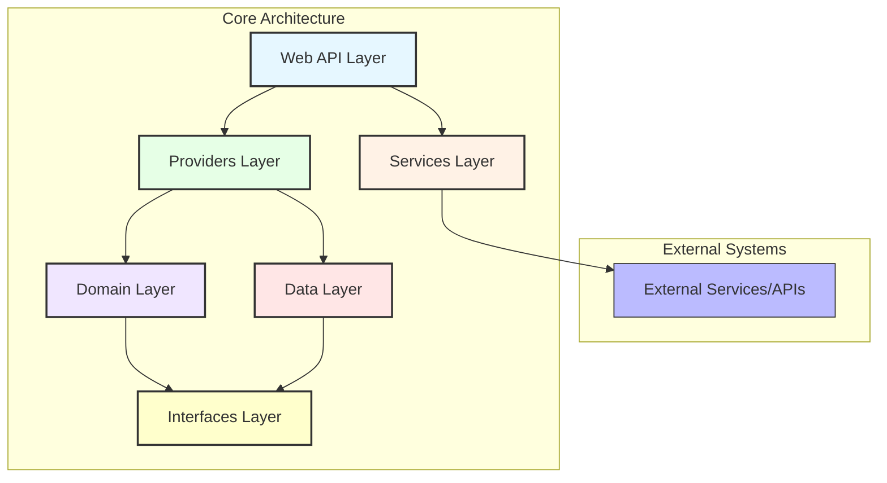

# 1. Paradigm.Enterprise Architecture

This document provides an architectural overview of the Paradigm.Enterprise framework, including its structure, design decisions, patterns, and how the various components interact.

## 1.1. Architectural Overview

The Paradigm.Enterprise framework is designed around clean architecture principles, with clear separation of concerns and dependencies flowing inward. The architecture consists of the following layers:



### 1.1.1. Core Layers

1. **Interfaces Layer** - Contains core interfaces that define contracts for the domain
2. **Domain Layer** - Contains domain entities, value objects, and business logic
3. **Data Layer** - Implements data access using the repository pattern
4. **Providers Layer** - Implements business logic and orchestrates operations
5. **Services Layer** - Provides abstractions for common application services
6. **WebApi Layer** - Exposes REST endpoints and handles HTTP concerns

### 1.1.2. Project Dependencies

```shell
WebApi → Providers → Domain → Interfaces
   ↓          ↓         ↓
Services      Data
   ↓
External Systems
```

## 1.2. Design Principles

The framework is built around several key design principles:

### 1.2.1. Dependency Inversion

The framework follows the Dependency Inversion Principle, with high-level modules not dependent on low-level modules, but both dependent on abstractions. This is achieved through extensive use of interfaces and dependency injection.

### 1.2.2. Single Responsibility

Each component in the framework has a single responsibility. For example:

- Repositories are responsible for data access
- Providers are responsible for business logic
- Controllers are responsible for HTTP concerns

### 1.2.3. Composition Over Inheritance

The framework favors composition over deep inheritance hierarchies, with base classes providing minimal functionality and most behavior added through composition.

### 1.2.4. Convention Over Configuration

Common patterns are implemented through conventions, reducing the need for explicit configuration. This is particularly evident in the naming conventions and standard CRUD operations.

## 1.3. Key Design Patterns

The framework implements several design patterns:

### 1.3.1. Repository Pattern

The Repository Pattern provides an abstraction over data access:

```csharp
public interface IRepository<T> where T : IEntity
{
    Task<T?> GetByIdAsync(int id);
    Task<IEnumerable<T>> GetAllAsync();
    Task<T> CreateAsync(T entity);
    Task<T> UpdateAsync(T entity);
    Task DeleteAsync(int id);
}
```

### 1.3.2. Unit of Work Pattern

The Unit of Work Pattern manages the atomic persistence of changes:

```csharp
public interface IUnitOfWork
{
    Task<bool> CommitAsync();
    void RollbackChanges();
}
```

### 1.3.3. Provider Pattern

The Provider Pattern acts as a facade over repositories and services:

```csharp
public interface IEditProvider<TView, TEdit>
{
    Task<TView> CreateAsync(TEdit model);
    Task<TView> UpdateAsync(TEdit model);
    Task DeleteAsync(int id);
    Task<TView?> GetByIdAsync(int id);
    Task<IEnumerable<TView>> GetAllAsync();
}
```

### 1.3.4. Factory Pattern

The Factory Pattern is used to create instances of complex objects:

```csharp
public interface IEntityFactory<T> where T : IEntity
{
    T Create();
    T Create(Action<T> initializer);
}
```

### 1.3.5. Mediator Pattern

The Mediator Pattern is used for decoupling components and handling cross-cutting concerns.

## 1.4. Component Interactions

### 1.4.1. Typical Request Flow

1. **HTTP Request** → WebApi Controller
2. **Controller** → Provider (business logic)
3. **Provider** → Repository (data access)
4. **Repository** → Data Context (database)
5. **Data Context** → Database

For example, a typical CRUD operation flow:

```shell
[HTTP Request] → [ApiControllerCrudBase] → [EditProviderBase] → [RepositoryBase] → [EfDataContext] → [Database]
```

## 1.5. Extension Points

The framework provides several extension points:

1. **Custom Repositories** - Extend `RepositoryBase<T>` to add custom query methods
2. **Custom Providers** - Extend `ProviderBase` to add domain-specific operations
3. **Custom Controllers** - Extend `ApiControllerBase` to add custom endpoints
4. **Custom Services** - Implement service interfaces with custom implementations
5. **Middleware Extensions** - Add custom middleware to the pipeline

## 1.6. Cross-cutting Concerns

### 1.6.1. Logging

Logging is implemented throughout the framework:

```csharp
public class ApiControllerBase<TProvider>
{
    protected readonly ILogger Logger;

    public ApiControllerBase(ILogger logger, TProvider provider)
    {
        Logger = logger;
        Provider = provider;
    }
}
```

### 1.6.2. Exception Handling

Centralized exception handling is provided through middleware:

```csharp
public class ExceptionHandlingMiddleware
{
    public async Task InvokeAsync(HttpContext context, RequestDelegate next)
    {
        try
        {
            await next(context);
        }
        catch (Exception ex)
        {
            await HandleExceptionAsync(context, ex);
        }
    }
}
```

### 1.6.3. Validation

Validation is implemented through model validation and explicit validation methods:

```csharp
public abstract class EntityBase<TInterface, TEntity, TView>
{
    public virtual void Validate()
    {
        // Entity-specific validation logic
    }
}
```

### 1.6.4. Caching

Caching is implemented through the `ICacheService`:

```csharp
public interface ICacheService
{
    Task<T?> GetAsync<T>(string key);
    Task SetAsync<T>(string key, T value, TimeSpan expiration);
    Task<T> GetOrSetAsync<T>(string key, Func<Task<T>> factory, TimeSpan expiration);
}
```

## 1.7. Performance Considerations

The framework is designed with performance in mind:

1. **Async/Await** - All I/O operations are asynchronous
2. **Efficient Queries** - Repository methods generate efficient queries
3. **Caching** - Built-in caching capabilities
4. **Connection Management** - Efficient database connection management
5. **Pagination** - Support for pagination to handle large datasets

## 1.8. Security Considerations

The framework includes several security features:

1. **Input Validation** - All inputs are validated
2. **Output Encoding** - Proper encoding of outputs
3. **Authentication/Authorization** - Support for various authentication schemes
4. **CSRF Protection** - Cross-Site Request Forgery protection
5. **Secure Defaults** - Security-focused default settings

## 1.9. Testing Strategy

The framework is designed to be testable:

1. **Unit Testing** - All components can be unit tested
2. **Integration Testing** - Integration tests for data access and API endpoints
3. **Mocking** - Interfaces allow for easy mocking
4. **Test Fixtures** - Reusable test fixtures

## 1.10. Deployment Considerations

The framework supports various deployment scenarios:

1. **Docker Support** - Can be deployed in Docker containers
2. **Cloud-Ready** - Designed for cloud environments
3. **Configuration** - Environment-specific configuration
4. **Scaling** - Support for horizontal scaling

## 1.11. Conclusion

The Paradigm.Enterprise framework provides a comprehensive architecture for building enterprise web applications. By following clean architecture principles and implementing proven design patterns, it offers a solid foundation for developing maintainable and scalable applications.
