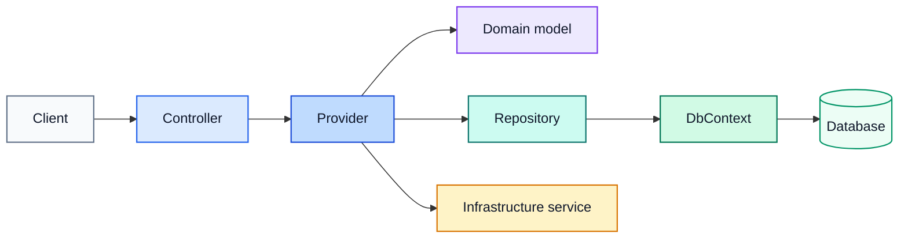

# Architecture

The architecture follows the direction of a request while keeping dependencies pointed toward domain contracts. An HTTP controller depends on a provider contract. A provider coordinates repositories and infrastructure services. Repositories use an Entity Framework context. Domain entities do not depend on ASP.NET Core or data-access implementations.


```mermaid
flowchart LR
  CLIENT[Client] --> CONTROLLER[Controller]
  CONTROLLER --> PROVIDER[Provider]
  PROVIDER --> DOMAIN[Domain model]
  PROVIDER --> REPOSITORY[Repository]
  REPOSITORY --> CONTEXT[DbContext]
  CONTEXT --> DATABASE[(Database)]
  PROVIDER --> SERVICE[Infrastructure service]

  style CLIENT fill:#f8fafc,stroke:#64748b,stroke-width:1.5px,color:#0f172a
  style CONTROLLER fill:#dbeafe,stroke:#2563eb,stroke-width:1.5px,color:#0f172a
  style PROVIDER fill:#bfdbfe,stroke:#1d4ed8,stroke-width:1.5px,color:#0f172a
  style DOMAIN fill:#ede9fe,stroke:#7c3aed,stroke-width:1.5px,color:#0f172a
  style REPOSITORY fill:#ccfbf1,stroke:#0f766e,stroke-width:1.5px,color:#0f172a
  style CONTEXT fill:#d1fae5,stroke:#047857,stroke-width:1.5px,color:#0f172a
  style DATABASE fill:#ecfdf5,stroke:#059669,stroke-width:1.5px,color:#0f172a
  style SERVICE fill:#fef3c7,stroke:#d97706,stroke-width:1.5px,color:#0f172a
```

## Controllers

Controllers own routing, model binding, HTTP response choices, and authorization metadata. The generic read and edit controller bases expose common endpoints, while `ApiControllerBase<TProvider>` offers a protected provider to derived controllers. Controllers should not resolve repositories or a `DbContext`.

All library controller bases inherit `AllowAnonymous` metadata. ASP.NET Core authorization middleware bypasses authorization for endpoints with that metadata, so adding `Authorize` to a derived controller or configuring a fallback policy does not make those endpoints secure. Use the bases only for intentionally anonymous endpoints. A secured API needs controllers that do not inherit the library bases, with providers injected directly and the host's authentication and authorization policies applied.

## Providers

Providers form the application layer. They coordinate a use case, call repositories and services, manage explicit transactions when needed, and decide when a unit of work commits. The generic edit provider also drives mapping and entity validation.

A provider may contain orchestration policy, such as deciding which collaborator to call or whether a multi-step operation is allowed to proceed. An invariant that must remain true for an entity belongs in the domain entity instead.

## Domain

The domain project holds entities, contracts used by repository and provider layers, mapping abstractions, pagination types, validation helpers, state machines, and Unit of Work contracts. Domain code should remain independent from HTTP and concrete database providers.

Aggregate roots define consistency boundaries. A repository for an aggregate root may remove child entities through the protected aggregate-removal helpers, but callers should not acquire separate repositories merely to bypass the aggregate.

## Data

Repositories isolate Entity Framework operations. `ReadRepositoryBase` supplies common reads and delegates paginated search to a protected function. `EditRepositoryBase` supplies add, update, and delete behavior. `RepositoryBase` resolves its context and registers that context with the current Unit of Work.

The SQL Server and PostgreSQL packages add connection providers and stored-procedure support. They do not change the layer boundaries.

## Services

A service represents infrastructure outside the domain model, such as Redis, email delivery, blob storage, or file parsing. Providers consume these services as collaborators. A service should not become a general container for business rules.

## Dependency direction

The source projects encode the main dependency chain:

```text
Interfaces
    Domain
        Data
            Providers
                WebApi
```

Database-specific packages depend on `Data`. Infrastructure service packages depend on `Services.Core`. Application projects may introduce additional contracts, but lower layers must not take a dependency on the Web API host.
