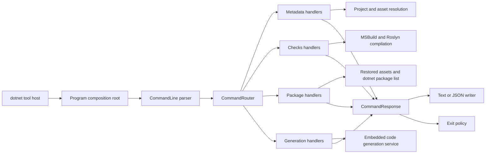
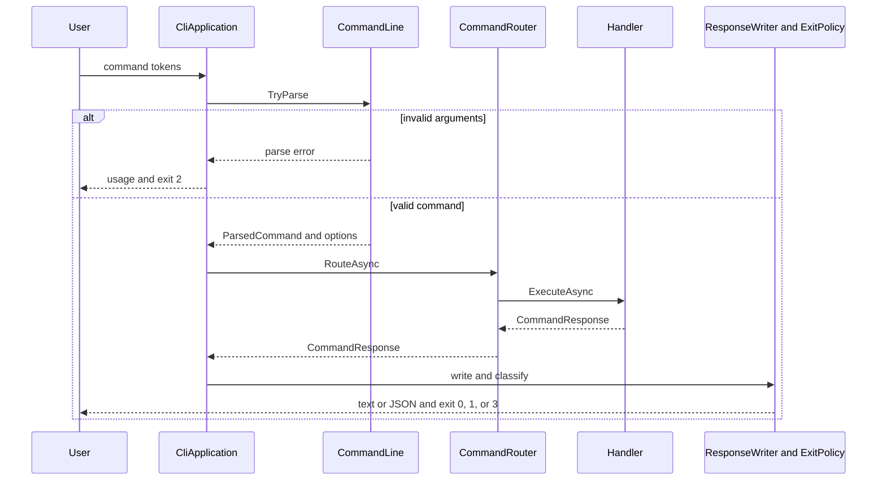

# CLI development

`Paradigm.Enterprise.Cli` is the only distributable command-line application in the repository. It is designed for client projects that consume Paradigm.Enterprise NuGet packages, not as a private build helper for the framework repository. The tool package therefore owns the complete installed experience: metadata discovery, validation, C# checks, package policy, online package audit, and explicit source generation all enter through the `paradigm` command.

The source is organized by responsibility so the project root remains small. `Application` owns parsing and the application boundary. `Commands` groups route handlers by Checks, Generation, and Metadata capability. `Composition` owns handler contracts, routing, response writing, exit policy, and adapters around lower-level services. `Configuration` owns `.paradigm/config.json` and suppression policy. `Infrastructure` owns project, output, and version mechanics. `Metadata` owns assembly inspection and curated API guidance. `Models` contains option, resolution, and response contracts. `Packages` owns restored-package policy and the explicit network audit. `Validation` contains metadata rules. `Program.cs` is the composition root and should remain the only file at the root besides project and package documentation.

```text
Paradigm.Enterprise.Cli/
  Application/
  Commands/
    Checks/
    Generation/
    Metadata/
  Composition/
    Contracts/
    Routing/
    Services/
  Configuration/
  Infrastructure/
    Output/
    Projects/
    Versioning/
  Metadata/
  Models/
    Options/
    Resolution/
    Responses/
  Packages/
  Validation/
  Program.cs
```

Every handwritten C# file follows the canonical [Paradigm Good Coding Practices](https://github.com/MiracleDevs/Paradigm.Enterprise/blob/main/.agents/references/good-coding-practices.md). Keep one top-level semantic type per file, place it in the folder that owns its meaning, use the canonical member-region order, and leave exactly one empty line inside and between regions. `PE3105` and `PE3106` enforce these source-layout rules. Do not move package command source into a generic helper folder: `Packages` is product source and is deliberately exempted from the repository's broad NuGet packages ignore rule.

## Runtime architecture

`Program.cs` constructs narrow services and registers one handler for every route. `CommandLine` converts tokens into an immutable option record. `CommandRouter` selects a handler by its exact route. Handlers coordinate project resolution, metadata, checks, package services, or generation and return a `CommandResponse`. Response and exit policies are applied once at the application boundary.



The CLI references `Paradigm.Enterprise.Checks.CSharp` and `Paradigm.Enterprise.CodeGenerator` as internal implementation assemblies. Packing the tool includes both assemblies and the bundled generator settings in the tool package. Those projects are not alternate tools and must not be published as client-facing executables or check-pack packages. `PackagingTests` inspects the archive to preserve this boundary, while `PackedCliIntegrationTests` installs the package into an isolated tool path and exercises the real composition root.

The request path is intentionally uniform. Parsing errors never enter a handler. A valid request is routed once, produces one response envelope, is written once, and is then mapped to an exit code. Resolution exceptions use the same response shape for JSON callers.



## Feature and option ownership

Environment and metadata routes are `doctor`, `api search`, `api show`, `api guide`, `inspect`, and `validate`. They share project and restored-asset services, but only `inspect` and `validate` require a built application assembly. API routes inspect restored Paradigm package assemblies. `validate` additionally runs application conventions and suppression policy.

Check routes are `checks list` and `checks run`. Listing is project-independent. Running evaluates real projects through MSBuild and Roslyn, so it may execute trusted source generators and analyzers. The built-in check implementation is compiled into the installed tool and reports the `PE31` diagnostic family.

Package routes are `packages check` and `packages audit`. Check reads restored assets and remains offline. Audit performs the same local policy first, then invokes the .NET package-list JSON interface with `--no-restore`; this is the explicit network boundary. `--warnings-as-errors` belongs only to audit.

Generation routes are `generate json`, `generate mappers`, and `generate client`. JSON and mapper generation require `--project-name`, a built DLL through `--assembly`, and `--output`. Client generation requires a trusted OpenAPI URL through `--document` and an output directory. Every generation route accepts `--settings` for a reviewed settings replacement. Generation writes files and returns `PE8001` for a reviewed operational failure.

Project-aware routes accept `--project`; all except `doctor` may accept `--framework`. API routes alone accept `--package`, and search alone accepts `--limit`. Checks and package routes that apply policy accept `--config`. All operational routes accept `--format text|json`. The complete user-facing syntax is maintained in [the CLI command reference](../cli.md), and `CommandLineTests.Command_reference_contains_every_current_usage_signature` prevents a command signature from being added to runtime help without also appearing there.

## Project and trust boundaries

Project resolution accepts directories, C# projects, `.sln`, and `.slnx`. Asset resolution reads the selected project's restored assets, evaluates target framework and MSBuild output, and reports missing or stale build output. Keep these mechanics under `Infrastructure/Projects`; handlers should ask through the composition service contracts and should not duplicate path selection.

Metadata inspection uses `MetadataLoadContext`, so it does not launch the consuming application. The semantic checks have a broader trust boundary because MSBuild evaluation and Roslyn generator execution can run code supplied by the project or its packages. JSON and mapper generation load a caller-supplied assembly. Client generation reads a caller-supplied URL. Any new command that executes code, reaches the network, or writes files must make that boundary explicit in runtime behavior and in the user documentation.

Responses use schema `1.1`. Preserve `schemaVersion`, `command`, `status`, `packages`, `results`, and `diagnostics`; additive feature data belongs in an optional typed property such as `guide` or `checks`. Text output may summarize large result sets, but JSON output must remain complete. Exit `0` means success or warnings, `1` means a completed command produced an error diagnostic, `2` means invalid arguments or project selection, and `3` means assets or metadata resolution failed.

## Adding or changing a command

Start with an immutable option record under `Models/Options`, then update `CommandLine.Usage` and its parser validation together. Implement one handler type in the capability folder that owns the route. Expose collaborators through an existing narrow composition contract or add one focused contract and adapter when a new boundary is required. Register the handler in `Program.cs`. Keep parsing, output formatting, and exit classification out of the handler.

Update [the CLI command reference](../cli.md) in the same change. Add parser tests for accepted and rejected option combinations, a handler or service test for behavior, and a packed-tool test when packaging, composition, generation, subprocess, or dependency loading changes. A new mutating or network command also needs an explicit trust-boundary test and documentation.

Do not add a NuGet dependency for a small parsing, routing, or formatting problem. If a package is genuinely required, follow the repository dependency policy: explain the alternative, verify the source and license, and obtain user permission before changing the project. Keep implementation types private or internal by default and prefer immutable records and read-only collaborators.

## Packaging and verification

The supported distribution is the `Paradigm.Enterprise.Cli` .NET tool package. Local verification must pack that package, install it into an isolated tool path or local manifest from the produced feed, and execute the installed `paradigm` command. A successful project build alone does not prove that implementation assemblies, settings, or command registration survived packing.

Before handing off a CLI change, format the affected projects, build and run `Paradigm.Enterprise.Cli.Tests`, run the installed tool's built-in checks against the CLI, checks, generator, and test projects, run the skill and plugin validators when guidance changed, and build DocFX with warnings as errors. Run `bash build/quality.sh` from any directory for the complete local equivalent. The script uses isolated temporary package and tool directories, then repeats the source build, tests, pack and install path, example validation, deterministic checks, and documentation build performed by the PR quality workflow.
