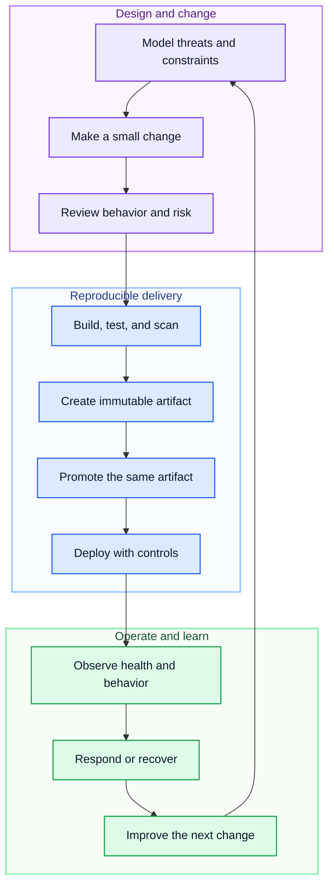

# Secure delivery

Secure delivery is the path from a reviewed source change to an observable, recoverable release. It combines development, security, quality, and operations throughout the lifecycle instead of treating security as a final certification step.

Paradigm.Enterprise participates in that path as a versioned dependency with build and test requirements. It does not configure an application's repository protections, identity platform, pipeline, artifact registry, deployment environment, infrastructure, monitoring, or recovery process. Those controls belong to the application team and its platform.

The delivery lifecycle is a feedback loop owned by that team and platform:

Every stage in this diagram is team or platform guidance. The library does not supply repository policy, scanners, artifact promotion, deployment automation, telemetry storage, alerting, or recovery orchestration.

## Start with the system boundary

Before choosing tools, identify the assets being protected, the actors that use them, the trust boundaries they cross, and the consequences of misuse or failure. A data-flow diagram can expose where untrusted input enters, where identity changes form, where sensitive data is stored, and where the system calls an external dependency.

Threat modeling should examine authentication, authorization, tampering, information disclosure, denial of service, privilege escalation, and the ability to reconstruct sensitive actions. It should also consider accidental failures such as an unavailable database, a delayed message, a partial deployment, or a restore that takes longer than expected.

Translate meaningful threats into design decisions and tests. An authorization rule needs a negative API test. A sensitive value needs a storage, transport, logging, and retention policy. An important external call needs timeout and failure behavior. Keep the model current when a new endpoint, data flow, integration, or deployment boundary changes the attack surface.

The [Secure host configuration](security-and-host.md) guide covers the framework-specific HTTP concerns, including the inherited `AllowAnonymous` behavior of the generic controller bases. A pipeline cannot compensate for an endpoint whose runtime authorization model is incorrect.

## Control how changes enter the release line

Protect the release branch with review and required validation. Keep changes small enough to understand, associate them with their purpose, and record architectural or security decisions when they introduce a lasting constraint.

Automation should verify facts that can be checked consistently. A typical application pipeline restores locked dependencies, builds from a clean checkout, runs tests, validates formatting and contracts, scans for exposed secrets and known dependency risks, and produces a versioned artifact. Static analysis and composition analysis support review, but they do not decide whether a new route exposes too much data or whether a retry can duplicate a business action.

Human review should examine behavior, authorization, data exposure, contract compatibility, transaction boundaries, idempotency, observability, and operational impact. Generated source and database migrations deserve the same review as hand-written code.

Pipeline identities should have only the permissions needed for their stage. Separate the ability to validate a change, publish an artifact, and deploy to a protected environment when the risk model requires it. Prefer short-lived or federated identity over long-lived deployment credentials.

## Protect the software supply chain

Every dependency, build action, container base image, generated artifact, and infrastructure module becomes part of the delivered system. Pin tools and actions to an intentional version policy, review updates, and remove dependencies that no longer have a justified purpose.

Software composition analysis can identify known vulnerable packages and license concerns. Secret scanning can detect many accidental credentials. Static analysis can find classes of unsafe code. Container and infrastructure scans can check deployable definitions. Each control needs an owner and a response policy so findings are resolved rather than accumulated as permanent noise.

A software bill of materials records which components are present in a release and helps assess exposure when a vulnerability is disclosed. Paradigm.Enterprise does not generate an SBOM. The application or platform pipeline should generate and retain one when traceability, incident response, or compliance requirements justify it.

Treat generated artifacts as immutable after validation. Record enough provenance to connect an artifact to its source revision, dependency set, pipeline run, tests, and security checks.

## Build once and promote deliberately

Build the deployable artifact once, then promote that same artifact through the required environments. Environment-specific configuration should be supplied at deployment or startup, not introduced by rebuilding different binaries for each environment.

Development, test, staging, and production environments serve different purposes and should have separate access, configuration, secrets, and data policies. When constraints require environments to be combined, document the risk and compensating controls rather than allowing the exception to become invisible.

Use a secret store appropriate to the deployment platform. Prefer managed or workload identity when supported. Do not place credentials in source-controlled settings, generated files, container images, pipeline logs, or manually shared scripts. Define precedence clearly when an integration supports both a connection string and managed identity.

Infrastructure as code makes environments reviewable and reproducible. Network rules, identities, compute, storage, monitoring, and deployment configuration can then follow the same review and validation principles as application code. Paradigm.Enterprise does not supply infrastructure definitions, policy enforcement, or drift detection.

## Choose a release strategy from risk

A direct replacement may be sufficient for a small internal host with quick rollback. Rolling, blue-green, canary, or feature-flagged releases can reduce risk when traffic, compatibility, or business impact justify the additional machinery.

A progressive deployment is only safer when the team can detect degradation and stop or reverse the rollout. Define success signals, rollback conditions, database compatibility, and responsibility before deployment. A feature flag also needs ownership, access control, telemetry, and a removal plan.

Database changes require particular care because application rollback may not reverse a destructive schema change. Prefer changes that allow old and new application versions to coexist during the rollout. Backfill or cleanup can follow after the new path is proven.

Promotions and approvals should produce traceable evidence without becoming disconnected manual work. The release record should identify the artifact, environment, decision, verification results, and operator.

## Design runtime security in depth

Authenticate identities at the correct boundary and authorize each sensitive action according to application policy. Apply least privilege to users, services, database accounts, deployment identities, and operational tools. Network segmentation and private connectivity reduce exposure but do not replace authorization.

Minimize the data collected, returned, and retained. Encrypt sensitive traffic and storage using platform-supported controls. Avoid placing tokens, credentials, request bodies, personal data, or file content in logs and traces unless a documented need and protection model exist.

Input validation should cover syntax, business meaning, size, content type, and file content where applicable. Parameterized data access and safe serialization configuration remain necessary even when requests pass through a trusted client.

Security controls should fail predictably. Return minimal error information to callers, preserve diagnostic detail in protected telemetry, and test unauthenticated, unauthorized, malformed, oversized, and replayed requests according to the endpoint's threat model.

## Make releases observable

A release should make its version and health visible. Structured logs, metrics, traces, and health checks should let operators correlate a user-visible failure with the responsible use case, dependency, and deployment.

Measure signals that lead to action. Request rate, errors, and duration are useful for request-driven services. Dependency saturation and resource utilization can explain capacity problems. A service-level indicator and objective can be useful for a critical service when there is an owner, a measurement source, and a response when the objective is missed.

Paradigm.Enterprise does not define SLI or SLO policy. It provides places where an application can instrument HTTP requests, provider use cases, repositories, and infrastructure adapters. The [Operations and health](operations.md) guide describes those boundaries.

An alert needs a meaningful condition, severity, owner, context, and response procedure. Alerting on every exception creates noise. Alerting only after users report an outage provides no operational protection.

## Plan for failure and recovery

Timeouts bound how long a dependency can consume resources. Retries can recover from transient failure when they are bounded and the operation is safe to repeat. Circuit breakers can reduce pressure on a failing dependency. Bulkheads and rate limits can keep one workload from exhausting the host.

These are host or adapter policies, not Enterprise package features. Apply them with knowledge of the operation. A write that is not idempotent can be duplicated by a retry. A database commit followed by a failed remote call cannot be repaired by rolling back a transaction that has already completed.

Outbox processing, durable queues, and sagas can coordinate work that crosses transactional boundaries. They require persisted state, duplicate handling, monitoring, repair procedures, and tests. Adopt them only when the required delivery guarantee justifies that operational model.

Continuity begins with explicit recovery objectives. Decide how much data loss is tolerable, how quickly service must return, which dependencies must recover first, and who owns the process. Backups are useful only when restoration is tested and the evidence shows that recovery objectives can be met.

The application and platform own backup, retention, disaster recovery, regional resilience, and incident response. The library does not provide those capabilities.

## Release readiness

Before promotion, confirm that the change has passed its required build, tests, contract validation, security controls, and review. Confirm that configuration and secrets are available through the intended sources, database changes are compatible with the deployment order, and the artifact is the same one that was validated.

For a material change, also confirm that health signals, dashboards, alerts, rollback or recovery steps, and ownership are ready. Record any accepted risk and the condition under which it must be revisited.

After deployment, verify the release version, health, representative behavior, authorization failures, dependency signals, and error rate. Keep the evidence with the release record, and turn incidents or unexpected manual work into improvements to the next delivery cycle.
