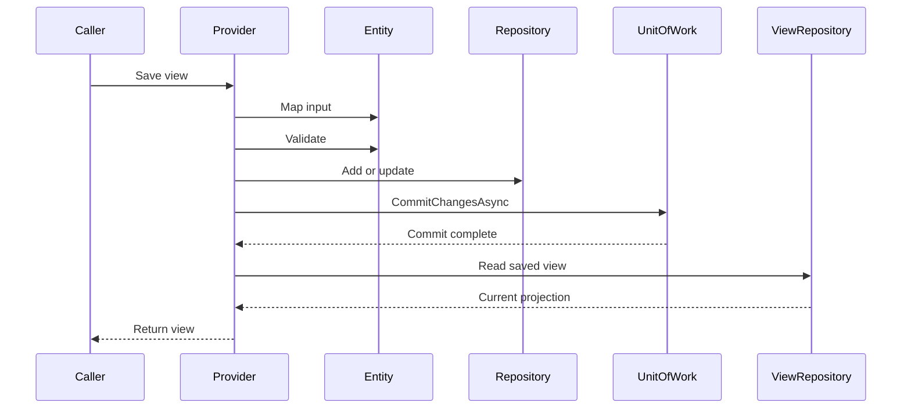

# Providers

Providers are the application layer. They turn an intention such as saving a record or running a search into a sequence of domain, repository, service, and transaction operations. Because a provider has no dependency on HTTP, the same use case can be invoked by a controller, worker, or message consumer.

`ProviderBase` holds the application service provider and can resolve another provider through `GetProvider<TProvider>`. Prefer explicit collaborators when a custom provider grows complex, but understand that the generic bases resolve their repository and Unit of Work through this service provider.

## Read providers

`ReadProviderBase<TInterface, TView, TViewRepository, TId>` delegates common reads to a view repository. `GetByIdAsync` converts a missing view into `NotFoundException`; collection reads return the repository result. Search accepts any `PaginationParametersBase` subtype.

## Edit providers

`EditProviderBase<TInterface, TEntity, TView, TRepository, TViewRepository, TId>` adds the write workflow. It maps the incoming view, validates the entity, stages the repository operation, commits the Unit of Work, runs lifecycle hooks, and returns a view.

Single and batch operations differ slightly. Single add and update return a fresh value through `GetByIdAsync`. Batch operations map the saved entities directly after the commit. If a database-generated or read-view value must always be returned, account for that distinction in the custom provider.

## Lifecycle hooks

Single add and update operations call the view-level `BeforeAdd` or `BeforeUpdate` hook and `BeforeSave` before mapping. They then validate the entity, call the corresponding entity-level hooks, stage the repository operation, and commit. Entity-level `AfterSave` and `AfterAdd` or `AfterUpdate` hooks run after that commit.

The bulk `SaveAsync(IEnumerable<TView>)` path is different. It skips the view-level hook overloads, but still maps and validates each entity, runs the entity-level before hooks, commits the batch, and runs the entity-level after hooks.

Delete operations call `BeforeDelete`, stage the repository deletion, call `AfterDelete`, and only then commit. `AfterDelete` therefore means after repository staging, not after a successful database commit.

Use entity hooks and `Validate` for intrinsic state rules. Use provider hooks for checks requiring a repository, orchestration with services, or application policy. Avoid placing protocol concerns such as status codes in a provider.

## Custom providers

Use `ProviderBase` directly when generic CRUD does not match the use case. A custom provider can still consume repository contracts and `IUnitOfWork`; it simply owns the workflow explicitly.

Provider registration is convention based. A public concrete `CatalogItemProvider` must satisfy `IProvider` and implement the exact-name `ICatalogItemProvider` interface. The normal design is for that application interface to inherit the typed Enterprise provider contract so consumers and generic registrations receive the complete API. See [Dependency registration](guides/dependency-registration.md) for discovery behavior and lifetimes.
