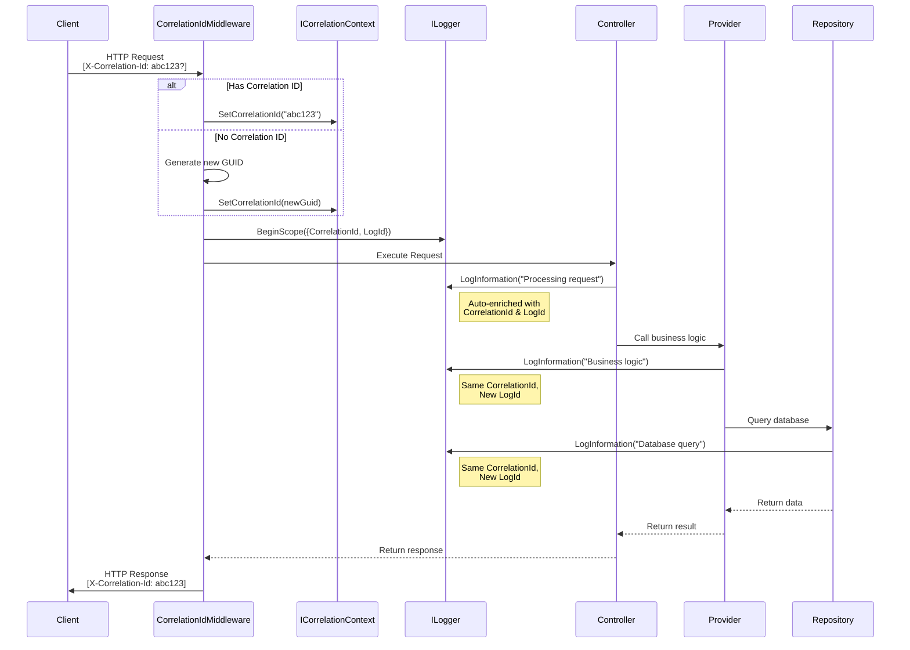

- [RFC: Correlation ID and Log ID for Request Tracing](#rfc-correlation-id-and-log-id-for-request-tracing)
  - [Summary](#summary)
  - [Motivation](#motivation)
    - [Current State](#current-state)
    - [Problems This Solves](#problems-this-solves)
    - [Expected Outcomes](#expected-outcomes)
  - [Detailed Design](#detailed-design)
    - [Architecture Overview](#architecture-overview)
    - [Correlation ID Component Design](#correlation-id-component-design)
      - [1. ICorrelationContext Interface](#1-icorrelationcontext-interface)
      - [2. CorrelationContext Implementation](#2-correlationcontext-implementation)
      - [3. CorrelationIdMiddleware](#3-correlationidmiddleware)
    - [Log ID Component Design](#log-id-component-design)
      - [1. What is a Log ID?](#1-what-is-a-log-id)
      - [2. Correlation ID vs. Log ID: Complementary Concepts](#2-correlation-id-vs-log-id-complementary-concepts)
      - [3. Why Template-Based Hashing?](#3-why-template-based-hashing)
      - [4. Implementation Approach](#4-implementation-approach)
    - [ServiceCollection Extensions](#servicecollection-extensions)
    - [ApplicationBuilder Extensions](#applicationbuilder-extensions)
    - [Automatic Log Enrichment](#automatic-log-enrichment)
    - [Explicit Correlation ID Access](#explicit-correlation-id-access)
    - [Client-Side Usage](#client-side-usage)
    - [Integration with Exception Handling](#integration-with-exception-handling)
    - [Performance Considerations](#performance-considerations)
    - [Security Considerations](#security-considerations)
  - [Alternatives Considered](#alternatives-considered)
    - [Alternative 1: Activity API and Distributed Tracing](#alternative-1-activity-api-and-distributed-tracing)
    - [Alternative 2: Custom Logger Wrapper](#alternative-2-custom-logger-wrapper)
    - [Alternative 3: Attribute-Based Correlation](#alternative-3-attribute-based-correlation)
    - [Alternative 4: Logging Provider Extension](#alternative-4-logging-provider-extension)
    - [Alternative 5: Manual Log IDs via Explicit Scopes](#alternative-5-manual-log-ids-via-explicit-scopes)
  - [Testing Strategy](#testing-strategy)
    - [Unit Tests](#unit-tests)
    - [Integration Tests](#integration-tests)
    - [Manual Testing Procedures](#manual-testing-procedures)
  - [Dependencies](#dependencies)
    - [Framework Dependencies](#framework-dependencies)
    - [NuGet Packages](#nuget-packages)
    - [Built-In Logging Providers (All Available by Default)](#built-in-logging-providers-all-available-by-default)
    - [Integration Opportunities](#integration-opportunities)
  - [Open Questions](#open-questions)
    - [1. Should correlation IDs be validated for format/length?](#1-should-correlation-ids-be-validated-for-formatlength)
    - [3. Should we support correlation ID prefixes to distinguish client vs. server generated?](#3-should-we-support-correlation-id-prefixes-to-distinguish-client-vs-server-generated)
    - [4. What hashing algorithm should be used for Log ID generation?](#4-what-hashing-algorithm-should-be-used-for-log-id-generation)
    - [5. Should correlation IDs be included in database queries/commands?](#5-should-correlation-ids-be-included-in-database-queriescommands)
    - [6. How should we handle correlation across message queues and async operations?](#6-how-should-we-handle-correlation-across-message-queues-and-async-operations)
    - [7. Should we provide built-in rate limiting for identical correlation IDs?](#7-should-we-provide-built-in-rate-limiting-for-identical-correlation-ids)
    - [8. Should correlation context be available in Domain/Data layers?](#8-should-correlation-context-be-available-in-domaindata-layers)
  - [References](#references)
    - [External Resources](#external-resources)
    - [Internal References](#internal-references)
    - [Related RFCs](#related-rfcs)
    - [Recommended Reading](#recommended-reading)


# RFC: Correlation ID and Log ID for Request Tracing

- **RFC ID**: 2025-01-20-correlation-id-for-logs
- **Status**: Draft
- **Author(s)**: Pablo Ordoñez
- **Created**: 2025-01-20
- **Last Updated**: 2025-01-20

## Summary

This RFC proposes implementing a transparent correlation tracking system for the Paradigm.Enterprise framework that automatically enriches all log entries with a Correlation ID and Log ID. The Correlation ID enables end-to-end request tracing across distributed systems, while the Log ID (generated from message template hashing) provides a unique, searchable identifier for specific log message types.

**Key Differentiators**:

- **Zero Third-Party Dependencies**: Pure `Microsoft.Extensions.Logging` implementation, no external packages required
- **100% Transparent**: Existing `ILogger<T>` injection continues to work without any code changes
- **Automatic Log ID Generation**: Custom `ILogger` wrapper extracts message templates and generates deterministic Log IDs
- **Template-Based Hashing**: Same message template always produces the same Log ID for pattern analysis
- **Framework Native**: Uses only ASP.NET Core middleware, scoped services, and built-in logging infrastructure

The implementation leverages ASP.NET Core middleware, scoped services, custom logger wrappers, and SHA256 template hashing to achieve this with zero impact on existing code, requiring no changes to existing logging statements.

## Motivation

### Current State

The Paradigm.Enterprise framework currently uses `ILogger` throughout services, providers, and repositories for logging. However, the current logging implementation has several limitations:

1. **No Request Correlation**: When debugging issues in production, it's difficult to correlate log entries from the same request, especially across multiple services or layers.

2. **String-Based Log Searching**: Finding specific errors requires parsing and comparing log messages as strings, which is error-prone and time-consuming.

3. **Distributed System Challenges**: In distributed architectures with multiple microservices, databases, and client applications, tracing a request across system boundaries is nearly impossible without unique identifiers.

4. **Multi-User Concurrency**: When multiple users are active simultaneously, logs from different requests become interleaved, making it difficult to understand the sequence of events for a specific request.

5. **No Client-to-Server Tracing**: Frontend applications cannot pass a correlation identifier to track end-to-end user actions from the client through the backend.

### Problems This Solves

1. **Efficient Debugging**: Engineers can quickly find all logs related to a specific request by searching for a single Correlation ID, dramatically reducing time to resolution.

2. **End-to-End Tracing**: A single Correlation ID can flow from client applications through multiple backend services, databases, and external APIs, enabling complete request tracing.

3. **Log Aggregation**: When using centralized logging systems (file aggregation, Azure Monitor, custom log databases), Correlation IDs enable powerful grouping and filtering capabilities.

4. **Performance Analysis**: Track the complete lifecycle of a request to identify performance bottlenecks across system boundaries.

5. **Better Error Context**: When exceptions occur, all related log entries can be retrieved immediately, providing complete context for debugging.

6. **Simplified Support**: Support teams can ask users for a Correlation ID from error messages, enabling rapid diagnosis without reproducing issues.

### Expected Outcomes

By implementing Correlation ID and Log ID support, we will:

- Enable transparent request tracing with zero changes to existing logging code
- Provide structured, searchable metadata in all log entries
- Support end-to-end tracing from client applications through backend services
- Simplify debugging in production environments
- Establish a foundation for distributed tracing and APM tool integration
- Maintain developer productivity by avoiding repetitive logging boilerplate

## Detailed Design

### Architecture Overview

The implementation follows a transparent enrichment pattern that leverages ASP.NET Core's middleware pipeline and `ILogger` scoping capabilities.



### Correlation ID Component Design

#### 1. ICorrelationContext Interface

**Location**: `src/Paradigm.Enterprise.WebApi/Services/ICorrelationContext.cs`

```csharp
namespace Paradigm.Enterprise.WebApi.Services;

/// <summary>
/// Provides access to the correlation ID for the current request.
/// This service is scoped per request and enables correlation tracking across the entire request lifecycle.
/// </summary>
public interface ICorrelationContext
{
    /// <summary>
    /// Gets the correlation ID for the current request.
    /// </summary>
    string CorrelationId { get; }

    /// <summary>
    /// Sets the correlation ID for the current request.
    /// This should only be called by the CorrelationIdMiddleware.
    /// </summary>
    /// <param name="correlationId">The correlation ID to set.</param>
    void SetCorrelationId(string correlationId);
}
```

**Design Rationale**:

- Scoped lifetime ensures one instance per request (similar to existing `ILoggedUserService`)
- Read-only property for consumers, setter for middleware only
- Simple, focused interface following Single Responsibility Principle

#### 2. CorrelationContext Implementation

**Location**: `src/Paradigm.Enterprise.WebApi/Services/CorrelationContext.cs`

```csharp
namespace Paradigm.Enterprise.WebApi.Services;

/// <summary>
/// Scoped implementation of ICorrelationContext that stores the correlation ID
/// for the current HTTP request.
/// </summary>
public class CorrelationContext : ICorrelationContext
{
    private string _correlationId = string.Empty;

    /// <inheritdoc />
    public string CorrelationId => _correlationId;

    /// <inheritdoc />
    public void SetCorrelationId(string correlationId)
    {
        // we have a setter instead of a construction method for the Id,
        // because the Id could come on the HTTP Request, constructed by
        // a previous service, and we need to maintain the same correlation.
        // So the OOP idea of the CorrelationContext Owning the creation does not
        // work here, the context only holds the value.
        if (string.IsNullOrWhiteSpace(correlationId))
            throw new ArgumentException("Correlation ID cannot be null or empty.", nameof(correlationId));

        _correlationId = correlationId;
    }
}
```

**Design Rationale**:

- Thread-safe by design (scoped instance per request)
- Validation prevents empty correlation IDs
- Immutable once set (no setter exposure)

#### 3. CorrelationIdMiddleware

**Location**: `src/Paradigm.Enterprise.WebApi/Middlewares/CorrelationIdMiddleware.cs`

```csharp
using Microsoft.AspNetCore.Http;
using Microsoft.Extensions.Logging;
using Paradigm.Enterprise.WebApi.Services;

namespace Paradigm.Enterprise.WebApi.Middlewares;

/// <summary>
/// Middleware that manages correlation IDs for request tracing.
/// Extracts correlation IDs from request headers or generates new ones,
/// enriches logs with correlation data, and adds correlation IDs to response headers.
/// </summary>
public class CorrelationIdMiddleware : MiddlewareBase
{
    #region Constants

    /// <summary>
    /// The HTTP header name for the correlation ID.
    /// Standard header name compatible with most APM and logging tools.
    /// </summary>
    private const string CorrelationIdHeaderName = "X-Correlation-Id";

    #endregion

    #region Constructor

    /// <summary>
    /// Initializes a new instance of the <see cref="CorrelationIdMiddleware"/> class.
    /// </summary>
    /// <param name="next">The next middleware in the pipeline.</param>
    public CorrelationIdMiddleware(RequestDelegate next) : base(next)
    {
    }

    #endregion

    #region Public Methods

    /// <summary>
    /// Invokes the middleware to process the HTTP request.
    /// </summary>
    /// <param name="context">The HTTP context.</param>
    /// <param name="correlationContext">The correlation context service.</param>
    /// <param name="logger">The logger instance.</param>
    public override async Task Invoke(
        HttpContext context,
        ICorrelationContext correlationContext,
        ILogger<CorrelationIdMiddleware> logger)
    {
        // Extract or generate correlation ID
        var correlationId = GetOrCreateCorrelationId(context);

        // Set in the scoped correlation context
        correlationContext.SetCorrelationId(correlationId);

        // Add correlation ID to response headers for client consumption
        AddCorrelationIdToResponse(context, correlationId);

        // Create a logging scope with correlation data that will be automatically
        // included in all log entries within this request
        using (logger.BeginScope(new Dictionary<string, object>
        {
            ["CorrelationId"] = correlationId,
            ["RequestPath"] = context.Request.Path.ToString(),
            ["RequestMethod"] = context.Request.Method
        }))
        {
            await Next(context);
        }
    }

    #endregion

    #region Private Methods

    /// <summary>
    /// Gets the correlation ID from the request header or creates a new one.
    /// </summary>
    /// <param name="context">The HTTP context.</param>
    /// <returns>The correlation ID.</returns>
    private static string GetOrCreateCorrelationId(HttpContext context)
    {
        if (context.Request.Headers.TryGetValue(CorrelationIdHeaderName, out var correlationId)
            && !string.IsNullOrWhiteSpace(correlationId))
        {
            return correlationId.ToString();
        }

        // Generate a new correlation ID using a compact GUID format
        return Guid.NewGuid().ToString("N");
    }

    /// <summary>
    /// Adds the correlation ID to the response headers.
    /// </summary>
    /// <param name="context">The HTTP context.</param>
    /// <param name="correlationId">The correlation ID.</param>
    private static void AddCorrelationIdToResponse(HttpContext context, string correlationId)
    {
        // Use OnStarting to ensure headers are added before response starts
        context.Response.OnStarting(() =>
        {
            if (!context.Response.Headers.ContainsKey(CorrelationIdHeaderName))
            {
                context.Response.Headers.Append(CorrelationIdHeaderName, correlationId);
            }
            return Task.CompletedTask;
        });
    }

    #endregion
}
```

**Design Rationale**:

- Extends `MiddlewareBase` following framework patterns
- Header name `X-Correlation-Id` is an industry standard
- `Guid.NewGuid().ToString("N")` provides compact 32-character IDs without hyphens
- `BeginScope()` ensures automatic log enrichment without code changes
- `OnStarting()` ensures headers are added before response stream begins
- Additional request metadata (path, method) aids in debugging

### Log ID Component Design

While the Correlation ID connects all logs from a single request, there's a second challenge in log management: **finding all instances of the same type of log message across different requests**. This is where the **Log ID** comes in.

#### 1. What is a Log ID?

A Log ID is a **deterministic, short identifier** (8-character hexadecimal) generated from the **message template** of a log entry—not from the actual parameter values. This means:

| Log Statement | Message Template | Log ID |
|---------------|-----------------|--------|
| `_logger.LogInformation("User {UserId} logged in", 123)` | `"User {UserId} logged in"` | `a7f3e1c9` |
| `_logger.LogInformation("User {UserId} logged in", 456)` | `"User {UserId} logged in"` | `a7f3e1c9` |
| `_logger.LogInformation("User {UserId} logged out", 123)` | `"User {UserId} logged out"` | `b8e4f2d0` |

Notice how the first two logs share the same Log ID because they use the same template, despite having different `UserId` values.

> [!IMPORTANT] Important:
> For this to work as expected, we must avoid string interpolation and use the older StringFormat.AppendFormat approach, to keep the template string separate from the value replacements.

#### 2. Correlation ID vs. Log ID: Complementary Concepts

These two identifiers serve distinct but complementary purposes:

| Aspect | Correlation ID | Log ID |
|--------|----------------|--------|
| **Scope** | Per-request | Per-message-template |
| **Question Answered** | "What happened during this request?" | "Where does this type of log occur?" |
| **Generation** | GUID (random or client-provided) | SHA256 hash of message template |
| **Uniqueness** | Unique per request | Same for identical templates |
| **Use Case** | Trace a single request end-to-end | Find all occurrences of a log pattern |

#### 3. Why Template-Based Hashing?

The Log ID is derived from the **message template** (the string with placeholders like `{UserId}`) rather than the formatted message (with actual values). This design choice enables:

1. **Pattern Detection**: Group logs by message type regardless of runtime values
2. **Frequency Analysis**: Count how often specific log patterns occur in production
3. **Noise Filtering**: Exclude known, high-frequency log patterns from alerts
4. **Trend Identification**: Track if certain log types are increasing over time
5. **Documentation Linking**: Link Log IDs to runbooks or troubleshooting guides

#### 4. Implementation Approach

The Log ID system consists of three main components:

1. **ILogIdGenerator / LogIdGenerator**: A service that hashes message templates to produce consistent 8-character identifiers
2. **EnrichedLoggerWrapper<T>**: Implements `ILogger<T>` and serves as the dependency injection entry point. This is what gets registered in the DI container and what consuming code receives when requesting `ILogger<T>`
3. **EnrichedLogger**: Contains the actual enrichment logic that extracts message templates and injects Log IDs into every log entry. This is used internally by `EnrichedLoggerWrapper<T>`

The beauty of this approach is **complete transparency**—developers continue using standard `ILogger<T>` injection and logging calls. The Log ID is added automatically behind the scenes, requiring zero code changes in existing services, providers, or controllers.

**EnrichedLoggerWrapper Implementation**:

```csharp
using Microsoft.Extensions.Logging;
using Paradigm.Enterprise.WebApi.Services;

namespace Paradigm.Enterprise.WebApi.Logging;

/// <summary>
/// Wrapper for ILogger<T> that automatically enriches logs with Log IDs.
/// This class is registered as the ILogger<T> implementation, making Log ID
/// injection completely transparent to consuming code.
/// </summary>
/// <typeparam name="T">The category type for the logger.</typeparam>
public class EnrichedLoggerWrapper<T> : ILogger<T>
{
    private readonly EnrichedLogger _enrichedLogger;

    public EnrichedLoggerWrapper(ILoggerFactory loggerFactory, ILogIdGenerator logIdGenerator)
    {
        var innerLogger = loggerFactory.CreateLogger<T>();
        _enrichedLogger = new EnrichedLogger(innerLogger, logIdGenerator, typeof(T).FullName!);
    }

    public IDisposable? BeginScope<TState>(TState state) where TState : notnull
        => _enrichedLogger.BeginScope(state);

    public bool IsEnabled(LogLevel logLevel)
        => _enrichedLogger.IsEnabled(logLevel);

    public void Log<TState>(
        LogLevel logLevel,
        EventId eventId,
        TState state,
        Exception? exception,
        Func<TState, Exception?, string> formatter)
        => _enrichedLogger.Log(logLevel, eventId, state, exception, formatter);
}
```

**Log ID Generator Interface**:

```csharp
namespace Paradigm.Enterprise.WebApi.Services;

/// <summary>
/// Generates unique Log IDs from message templates.
/// Log IDs enable pattern-based log searching and analysis.
/// </summary>
public interface ILogIdGenerator
{
    /// <summary>
    /// Generates a Log ID from a message template.
    /// The same template will always produce the same Log ID, regardless of parameter values.
    /// </summary>
    /// <param name="messageTemplate">The message template string.</param>
    /// <returns>An 8-character hexadecimal Log ID.</returns>
    string GenerateLogId(string messageTemplate);
}
```

**Log ID Generator Implementation**:

```csharp
using System.Security.Cryptography;
using System.Text;

namespace Paradigm.Enterprise.WebApi.Services;

/// <summary>
/// Generates deterministic Log IDs by hashing message templates.
/// Uses template-based hashing to ensure consistent IDs for the same log patterns.
/// </summary>
public class LogIdGenerator : ILogIdGenerator
{
    /// <inheritdoc />
    public string GenerateLogId(string messageTemplate)
    {
        if (string.IsNullOrWhiteSpace(messageTemplate))
            return "00000000";

        // Use SHA256 for consistent, deterministic hashing
        // This ensures the same template always produces the same LogId
        var bytes = Encoding.UTF8.GetBytes(messageTemplate);
        var hash = SHA256.HashData(bytes);

        // Take first 4 bytes and convert to 8-character hex string
        // This provides 4.3 billion unique combinations while staying human-readable
        return BitConverter.ToUInt32(hash, 0).ToString("x8");
    }
}
```

**How It Works**:

```csharp
// Example 1: Same template, different values -> Same LogId
var gen = new LogIdGenerator();
var id1 = gen.GenerateLogId("User {UserId} logged in");      // -> "a7f3e1c9"
var id2 = gen.GenerateLogId("User {UserId} logged in");      // -> "a7f3e1c9" (same!)

// Example 2: Different templates -> Different LogIds
var id3 = gen.GenerateLogId("User {UserId} logged out");     // -> "b8e4f2d0"
var id4 = gen.GenerateLogId("Product {ProductId} updated");  // -> "c9f5a3e1"

// Example 3: In practice (automatic with custom logger)
_logger.LogInformation("Processing order {OrderId}");
// Automatically gets LogId: "d0a6b4f2"
// Every "Processing order {OrderId}" log gets the same LogId!
```

**Custom Logger for Transparent Log ID Injection**:

```csharp
using Microsoft.Extensions.Logging;
using Paradigm.Enterprise.WebApi.Services;

namespace Paradigm.Enterprise.WebApi.Logging;

/// <summary>
/// Custom ILogger implementation that automatically enriches log entries with Log IDs.
/// This logger wraps the underlying logger and intercepts all log calls to inject
/// Log IDs based on message template hashing.
/// </summary>
public class EnrichedLogger : ILogger
{
    private readonly ILogger _innerLogger;
    private readonly ILogIdGenerator _logIdGenerator;
    private readonly string _categoryName;

    public EnrichedLogger(ILogger innerLogger, ILogIdGenerator logIdGenerator, string categoryName)
    {
        _innerLogger = innerLogger ?? throw new ArgumentNullException(nameof(innerLogger));
        _logIdGenerator = logIdGenerator ?? throw new ArgumentNullException(nameof(logIdGenerator));
        _categoryName = categoryName;
    }

    public IDisposable BeginScope<TState>(TState state) where TState : notnull
    {
        return _innerLogger.BeginScope(state);
    }

    public bool IsEnabled(LogLevel logLevel)
    {
        return _innerLogger.IsEnabled(logLevel);
    }

    public void Log<TState>(
        LogLevel logLevel,
        EventId eventId,
        TState state,
        Exception? exception,
        Func<TState, Exception?, string> formatter)
    {
        if (!IsEnabled(logLevel))
            return;

        // Extract message template from state
        var messageTemplate = ExtractMessageTemplate(state, formatter);
        var logId = _logIdGenerator.GenerateLogId(messageTemplate);

        // Create enriched state with LogId
        var enrichedState = EnrichState(state, logId);

        // Log with enriched state
        _innerLogger.Log(logLevel, eventId, enrichedState, exception,
            (s, ex) => formatter(state, ex));
    }

    /// <summary>
    /// Extracts the message template from the log state.
    /// </summary>
    private string ExtractMessageTemplate<TState>(TState state, Func<TState, Exception?, string> formatter)
    {
        // For structured logging, state is typically IReadOnlyList<KeyValuePair<string, object>>
        if (state is IReadOnlyList<KeyValuePair<string, object>> stateList)
        {
            // Look for the "{OriginalFormat}" key which contains the template
            foreach (var kvp in stateList)
            {
                if (kvp.Key == "{OriginalFormat}" && kvp.Value is string template)
                {
                    return template;
                }
            }
        }

        // Fallback: use formatted message (less ideal but better than nothing)
        return formatter(state, null);
    }

    /// <summary>
    /// Enriches the log state with the Log ID.
    /// </summary>
    private object EnrichState<TState>(TState state, string logId)
    {
        if (state is IReadOnlyList<KeyValuePair<string, object>> stateList)
        {
            // Create new list with LogId added
            var enrichedList = new List<KeyValuePair<string, object>>(stateList.Count + 1);
            enrichedList.AddRange(stateList);
            enrichedList.Add(new KeyValuePair<string, object>("LogId", logId));
            return enrichedList;
        }

        // For non-structured state, create a new object with LogId
        return new { State = state, LogId = logId };
    }
}
```

The Log ID is calculated from the `{OriginalFormat}` value, ensuring consistent IDs for the same template regardless of parameter values.

**Benefits**:

1. **100% Transparent**: Developers use standard `_logger.LogXxx()` calls with zero changes
2. **Zero Third-Party Dependencies**: Pure `Microsoft.Extensions.Logging` implementation
3. **Automatic LogId Injection**: Every log entry gets a LogId based on its template
4. **Pattern Detection**: Same template = same LogId across all requests and users
5. **Framework Integration**: Works with Console, Debug, EventSource, and any custom provider
6. **No Manual Scopes**: Unlike manual `BeginScope()` approach, completely automatic
7. **Production Ready**: Handles edge cases, null safety, and non-structured logging scenarios

### ServiceCollection Extensions

Add the following method:

```csharp
/// <summary>
/// Registers the logging services.
/// </summary>
/// <param name="services">The service collection.</param>
/// <returns>The service collection for chaining.</returns>
public static IServiceCollection AddLoggingServices(this IServiceCollection services)
{
    // Register correlation context (scoped per request)
    services.AddScoped<ICorrelationContext, CorrelationContext>();

    // Register Log ID generator (singleton for performance)
    services.AddSingleton<ILogIdGenerator, LogIdGenerator>();

    // Replace ILogger<T> registration with enriched wrapper
    services.AddSingleton(typeof(ILogger<>), typeof(EnrichedLoggerWrapper<>));
    return services;
}
```

**Complete Registration Example**:

```csharp
// In Program.cs
var builder = WebApplication.CreateBuilder(args);

// Standard logging configuration
builder.Logging.AddConsole();
builder.Logging.AddDebug();
builder.Logging.AddEventSourceLogger();
// Add any other logging providers

// Register correlation services (includes LogIdGenerator)
builder.Services.AddLoggingServices();

// Rest of service configuration
builder.Services.AddControllers();
builder.Services.RegisterProviders(Assembly.GetExecutingAssembly());
// ... other services

var app = builder.Build();

// Use correlation middleware
app.UseCorrelationId();
app.UseOwnExceptionHandler();
app.UseRouting();
app.UseAuthorization();
app.MapControllers();

app.Run();
```

### ApplicationBuilder Extensions

**Location**: Update `src/Paradigm.Enterprise.WebApi/Extensions/ApplicationBuilderExtensions.cs`

Add the following method:

```csharp
/// <summary>
/// Adds the correlation ID middleware to the application pipeline.
/// This should be called early in the pipeline to ensure all requests are tracked.
/// </summary>
/// <param name="app">The application builder.</param>
/// <returns>The application builder for chaining.</returns>
public static IApplicationBuilder UseCorrelationId(this IApplicationBuilder app)
{
    app.UseMiddleware<CorrelationIdMiddleware>();
    return app;
}
```

### Automatic Log Enrichment

Existing logging code requires **no changes**:

```csharp
public class ProductProvider : ProviderBase
{
    private readonly ILogger<ProductProvider> _logger;
    private readonly IProductRepository _repository;

    public ProductProvider(
        IServiceProvider serviceProvider,
        ILogger<ProductProvider> logger,
        IProductRepository repository) : base(serviceProvider)
    {
        _logger = logger;
        _repository = repository;
    }

    public async Task<Product> GetProductAsync(int productId)
    {
        // This log entry will automatically include CorrelationId, LogId, RequestPath, RequestMethod
        _logger.LogInformation("Fetching product with ID {ProductId}", productId);

        var product = await _repository.GetByIdAsync(productId);

        if (product == null)
        {
            // This error log will also include the correlation data
            _logger.LogWarning("Product {ProductId} not found", productId);
            throw new NotFoundException("Product", productId.ToString());
        }

        return product;
    }
}
```

**Log Output Example** (with Microsoft.Extensions.Logging JSON formatter):

```json
{
  "Timestamp": "2026-01-20T10:30:45.123Z",
  "Level": "Information",
  "MessageTemplate": "Fetching product with ID {ProductId}",
  "Properties": {
    "ProductId": 12345,
    "CorrelationId": "a1b2c3d4e5f6g7h8i9j0k1l2m3n4o5p6",
    "LogId": "a7f3e1c9",
    "RequestPath": "/api/products/12345",
    "RequestMethod": "GET",
    "SourceContext": "MyApp.Providers.ProductProvider"
  }
}
```

**Note**: The `LogId` (`a7f3e1c9`) is automatically generated from the message template `"Fetching product with ID {ProductId}"`. Every log statement with this exact template will have the same LogId, regardless of the actual `ProductId` value. This enables powerful pattern-based log searching and analysis.

### Explicit Correlation ID Access

For scenarios requiring explicit access (e.g., custom error responses):

```csharp
public class CustomErrorController : ApiControllerBase
{
    private readonly ICorrelationContext _correlationContext;

    public CustomErrorController(
        ILogger<CustomErrorController> logger,
        ICorrelationContext correlationContext) : base(logger)
    {
        _correlationContext = correlationContext;
    }

    [HttpPost]
    public IActionResult ReportError([FromBody] ErrorReport report)
    {
        Logger.LogError(
            "User reported error: {ErrorMessage}",
            report.Message);

        return Ok(new
        {
            Message = "Error reported successfully",
            CorrelationId = _correlationContext.CorrelationId,
            Timestamp = DateTime.UtcNow
        });
    }
}
```

### Client-Side Usage

Frontend applications can propagate correlation IDs:

```typescript
// JavaScript/TypeScript example
const correlationId = generateGuid();

fetch('/api/products/123', {
  headers: {
    'X-Correlation-Id': correlationId,
    'Content-Type': 'application/json'
  }
})
.then(response => {
  // Server echoes back the correlation ID
  const serverCorrelationId = response.headers.get('X-Correlation-Id');
  console.log('Request tracked with ID:', serverCorrelationId);
})
.catch(error => {
  console.error('Error with correlation ID:', correlationId);
  // Show correlation ID to user for support purposes
});
```

### Integration with Exception Handling

The existing `ExceptionHandlerMiddleware` can be enhanced to include correlation IDs in error responses:

```csharp
// In ExceptionHandlerMiddleware.cs - HandleExceptionAsync method
private async Task HandleExceptionAsync(HttpContext context, Exception exception)
{
    var handler = context.RequestServices.GetRequiredService<IExceptionHandler>();
    var correlationContext = context.RequestServices.GetRequiredService<ICorrelationContext>();

    exception = handler.Handle(exception);

    var code = exception switch
    {
        NotFoundException _ => HttpStatusCode.NotFound,
        AuthenticationException _ => HttpStatusCode.Unauthorized,
        NotAuthenticatedException _ => HttpStatusCode.Unauthorized,
        NotAuthorizedException _ => HttpStatusCode.Forbidden,
        _ => HttpStatusCode.InternalServerError
    };

    // Include correlation ID in error response
    var result = System.Text.Json.JsonSerializer.Serialize(
        new Error(GetErrorMessage(exception), correlationContext.CorrelationId),
        ApiModelsJsonContext.Default.Error);

    context.Response.ContentType = "application/json";
    context.Response.StatusCode = (int)code;

    await context.Response.WriteAsync(result);

    context.RequestServices
        .GetRequiredService<ILogger<ExceptionHandlerMiddleware>>()
        .LogError(exception, string.Empty);
}

// Update Error class
public class Error
{
    public string Message { get; set; }
    public string? CorrelationId { get; set; }

    public Error(string message, string? correlationId = null)
    {
        Message = message;
        CorrelationId = correlationId;
    }
}
```

### Performance Considerations

1. **GUID Generation**: Using `Guid.NewGuid().ToString("N")` for Correlation IDs is highly optimized in modern .NET
2. **SHA256 Hashing**: Log ID generation uses `SHA256.HashData()` which is fast (~1-2 microseconds per hash)
3. **Template Caching**: Consider implementing template cache in `LogIdGenerator` to avoid repeated hashing of common templates
4. **Scope Allocation**: `BeginScope()` creates a small dictionary allocation per request (~100 bytes)
5. **Header Parsing**: String header extraction is negligible overhead
6. **Logger Wrapper**: Single-layer wrapper adds minimal overhead (~50-100 nanoseconds per log call)
7. **State Enrichment**: Adding LogId to log state involves creating a new list (~24-48 bytes allocation per log entry)
8. **Overall Impact**: < 1ms per request in typical scenarios (including all correlation and logging overhead)

**Performance Optimization Opportunities**:

```csharp
// Optional: Add caching to LogIdGenerator for frequently used templates
public class LogIdGenerator : ILogIdGenerator
{
    private readonly ConcurrentDictionary<string, string> _cache = new();
    private const int MaxCacheSize = 1000; // Prevent unbounded growth

    public string GenerateLogId(string messageTemplate)
    {
        if (string.IsNullOrWhiteSpace(messageTemplate))
            return "00000000";

        // Check cache first
        if (_cache.TryGetValue(messageTemplate, out var cachedId))
            return cachedId;

        // Generate and cache
        var bytes = Encoding.UTF8.GetBytes(messageTemplate);
        var hash = SHA256.HashData(bytes);
        var logId = BitConverter.ToUInt32(hash, 0).ToString("x8");

        // Add to cache if not too large
        if (_cache.Count < MaxCacheSize)
        {
            _cache.TryAdd(messageTemplate, logId);
        }

        return logId;
    }
}
```

With caching, repeated log messages have near-zero overhead for LogId generation (dictionary lookup only).

### Security Considerations

1. **No PII in Correlation IDs**: GUIDs contain no personally identifiable information
2. **Client-Provided IDs**: The system accepts client-provided correlation IDs, which could theoretically be exploited for correlation attacks. Mitigation:
   - Validate format (GUID-like structure)
   - Rate limit requests with identical correlation IDs
   - Consider prefix for client vs. server-generated IDs
3. **Log Injection**: Correlation IDs are structured data, not concatenated strings, preventing log injection
4. **Response Headers**: Correlation IDs are echoed in response headers, which is standard practice

## Alternatives Considered

### Alternative 1: Activity API and Distributed Tracing

**Approach**: Use .NET's built-in `System.Diagnostics.Activity` API and W3C Trace Context standard.

**Advantages**:

- Standard .NET approach for distributed tracing
- Automatic propagation across async boundaries
- Support for trace/span hierarchies
- Integration with OpenTelemetry
- Richer data model (parent/child relationships)

**Disadvantages**:

- More complex implementation
- Requires APM tool integration for full value
- Higher learning curve for developers
- Heavier runtime overhead
- May be overkill for current needs

**Why Not Chosen**: While Activity API is powerful, it's more complex than needed for basic correlation. The proposed solution provides immediate value with simpler implementation. Activity API can be adopted later as a natural evolution.

### Alternative 2: Custom Logger Wrapper

**Approach**: Create a wrapper around `ILogger` that automatically adds correlation IDs.

```csharp
public interface ICorrelatedLogger
{
    void LogInformation(string message, params object[] args);
    // ... other methods
}
```

**Advantages**:

- Full control over log enrichment
- Can add additional metadata easily
- Type-safe approach

**Disadvantages**:

- Requires changing all existing `ILogger` references to `ICorrelatedLogger`
- Breaks compatibility with standard logging infrastructure
- Significant refactoring effort
- Doesn't work with third-party libraries that use `ILogger`

**Why Not Chosen**: The `BeginScope()` approach enriches standard `ILogger` without requiring code changes or breaking compatibility.

### Alternative 3: Attribute-Based Correlation

**Approach**: Use attributes on controllers/methods to opt-in to correlation tracking.

```csharp
[EnableCorrelation]
public class ProductsController : ApiControllerBase
{
    // ...
}
```

**Advantages**:

- Explicit opt-in
- Can disable for specific endpoints
- Clear declaration of intent

**Disadvantages**:

- Requires developer action (not transparent)
- Easy to forget on new controllers
- Inconsistent coverage
- More configuration overhead

**Why Not Chosen**: Transparent, automatic correlation is preferred. All requests should be tracked by default.

### Alternative 4: Logging Provider Extension

**Approach**: Extend the logging provider (e.g., custom enricher) to add correlation IDs.

**Advantages**:

- Zero application code changes
- Configured entirely in logging infrastructure

**Disadvantages**:

- Tightly coupled to specific logging provider
- Doesn't provide access to correlation ID in application code
- Can't pass correlation ID to response headers
- Less portable across projects

**Why Not Chosen**: While provider enrichment is valuable, it doesn't provide the full feature set (response headers, explicit access) needed for comprehensive correlation tracking.

### Alternative 5: Manual Log IDs via Explicit Scopes

**Approach**: Require developers to manually create scopes for Log IDs in specific operations.

```csharp
using (_logger.BeginScope(new Dictionary<string, object>
{
    ["OperationId"] = Guid.NewGuid().ToString("N").Substring(0, 8),
    ["Operation"] = "ImportProducts"
}))
{
    _logger.LogInformation("Starting product import");
    await ImportProductsAsync();
}
```

**Advantages**:

- Full developer control over when Log IDs are created
- Can create hierarchical operation IDs
- Flexible for complex scenarios

**Disadvantages**:

- **Requires developer intervention** - violates transparency requirement
- Developers must remember to add scopes for every operation
- Inconsistent adoption across codebase
- Additional code to write and maintain
- Log IDs would be different for same message types
- No pattern-based searching capability

**Why Not Chosen**: This approach **directly contradicts the core requirement** of transparency and "zero code changes." The automatic message template hashing approach provides Log IDs without any developer action, enabling pattern-based log analysis while maintaining the transparency principle. Manual scopes are still available for developers who need operation-level tracking beyond message patterns, but they are not the primary Log ID mechanism.

## Testing Strategy

### Unit Tests

Create test project: `Paradigm.Enterprise.Tests/WebApi/Services/CorrelationContextTests.cs`

```csharp
[TestClass]
public class CorrelationContextTests
{
    [TestMethod]
    public void SetCorrelationId_ValidId_SetsCorrelationId()
    {
        // Arrange
        var context = new CorrelationContext();
        var correlationId = "test-correlation-id";

        // Act
        context.SetCorrelationId(correlationId);

        // Assert
        Assert.AreEqual(correlationId, context.CorrelationId);
    }

    [TestMethod]
    [ExpectedException(typeof(ArgumentException))]
    public void SetCorrelationId_NullId_ThrowsException()
    {
        // Arrange
        var context = new CorrelationContext();

        // Act
        context.SetCorrelationId(null);
    }

    [TestMethod]
    [ExpectedException(typeof(ArgumentException))]
    public void SetCorrelationId_EmptyId_ThrowsException()
    {
        // Arrange
        var context = new CorrelationContext();

        // Act
        context.SetCorrelationId(string.Empty);
    }
}
```

Create test: `Paradigm.Enterprise.Tests/WebApi/Services/LogIdGeneratorTests.cs`

```csharp
[TestClass]
public class LogIdGeneratorTests
{
    [TestMethod]
    public void GenerateLogId_SameTemplate_ReturnsSameId()
    {
        // Arrange
        var generator = new LogIdGenerator();
        var template = "User {UserId} logged in";

        // Act
        var id1 = generator.GenerateLogId(template);
        var id2 = generator.GenerateLogId(template);

        // Assert
        Assert.AreEqual(id1, id2);
        Assert.IsFalse(string.IsNullOrWhiteSpace(id1));
    }

    [TestMethod]
    public void GenerateLogId_DifferentTemplates_ReturnsDifferentIds()
    {
        // Arrange
        var generator = new LogIdGenerator();
        var template1 = "User {UserId} logged in";
        var template2 = "User {UserId} logged out";

        // Act
        var id1 = generator.GenerateLogId(template1);
        var id2 = generator.GenerateLogId(template2);

        // Assert
        Assert.AreNotEqual(id1, id2);
    }

    [TestMethod]
    public void GenerateLogId_ValidTemplate_Returns8CharacterHex()
    {
        // Arrange
        var generator = new LogIdGenerator();
        var template = "Processing order {OrderId}";

        // Act
        var logId = generator.GenerateLogId(template);

        // Assert
        Assert.AreEqual(8, logId.Length);
        Assert.IsTrue(System.Text.RegularExpressions.Regex.IsMatch(logId, "^[0-9a-f]{8}$"));
    }

    [TestMethod]
    public void GenerateLogId_NullTemplate_ReturnsDefaultId()
    {
        // Arrange
        var generator = new LogIdGenerator();

        // Act
        var logId = generator.GenerateLogId(null);

        // Assert
        Assert.AreEqual("00000000", logId);
    }

    [TestMethod]
    public void GenerateLogId_EmptyTemplate_ReturnsDefaultId()
    {
        // Arrange
        var generator = new LogIdGenerator();

        // Act
        var logId = generator.GenerateLogId(string.Empty);

        // Assert
        Assert.AreEqual("00000000", logId);
    }

    [TestMethod]
    public void GenerateLogId_TemplateWithDifferentParameterValues_ReturnsSameId()
    {
        // Arrange
        var generator = new LogIdGenerator();
        // These would be the same template with different runtime values
        var template = "Fetching product with ID {ProductId}";

        // Act
        var id1 = generator.GenerateLogId(template);
        var id2 = generator.GenerateLogId(template);

        // Assert
        // Even though in practice ProductId would be different (123, 456, etc.),
        // the LogId is based only on the template, so it's always the same
        Assert.AreEqual(id1, id2);
    }

    [TestMethod]
    public void GenerateLogId_MultipleParameters_ConsistentHash()
    {
        // Arrange
        var generator = new LogIdGenerator();
        var template = "User {UserId} updated product {ProductId} in category {CategoryId}";

        // Act
        var id1 = generator.GenerateLogId(template);
        var id2 = generator.GenerateLogId(template);

        // Assert
        Assert.AreEqual(id1, id2);
        Assert.AreEqual(8, id1.Length);
    }
}
```

Create test: `Paradigm.Enterprise.Tests/WebApi/Middlewares/CorrelationIdMiddlewareTests.cs`

```csharp
[TestClass]
public class CorrelationIdMiddlewareTests
{
    [TestMethod]
    public async Task Invoke_NoCorrelationIdInRequest_GeneratesNewId()
    {
        // Arrange
        var context = new DefaultHttpContext();
        var correlationContext = new CorrelationContext();
        var logger = new Mock<ILogger<CorrelationIdMiddleware>>();
        var nextCalled = false;

        RequestDelegate next = (HttpContext ctx) =>
        {
            nextCalled = true;
            return Task.CompletedTask;
        };

        var middleware = new CorrelationIdMiddleware(next);

        // Act
        await middleware.Invoke(context, correlationContext, logger.Object);

        // Assert
        Assert.IsTrue(nextCalled);
        Assert.IsFalse(string.IsNullOrWhiteSpace(correlationContext.CorrelationId));
        Assert.IsTrue(context.Response.Headers.ContainsKey("X-Correlation-Id"));
    }

    [TestMethod]
    public async Task Invoke_CorrelationIdInRequest_UsesProvidedId()
    {
        // Arrange
        var expectedId = "client-provided-id";
        var context = new DefaultHttpContext();
        context.Request.Headers["X-Correlation-Id"] = expectedId;

        var correlationContext = new CorrelationContext();
        var logger = new Mock<ILogger<CorrelationIdMiddleware>>();

        RequestDelegate next = (HttpContext ctx) => Task.CompletedTask;
        var middleware = new CorrelationIdMiddleware(next);

        // Act
        await middleware.Invoke(context, correlationContext, logger.Object);

        // Assert
        Assert.AreEqual(expectedId, correlationContext.CorrelationId);
    }

    [TestMethod]
    public async Task Invoke_Always_AddsCorrelationIdToResponse()
    {
        // Arrange
        var context = new DefaultHttpContext();
        var correlationContext = new CorrelationContext();
        var logger = new Mock<ILogger<CorrelationIdMiddleware>>();

        RequestDelegate next = (HttpContext ctx) => Task.CompletedTask;
        var middleware = new CorrelationIdMiddleware(next);

        // Act
        await middleware.Invoke(context, correlationContext, logger.Object);

        // Trigger OnStarting callbacks
        await context.Response.StartAsync();

        // Assert
        Assert.IsTrue(context.Response.Headers.ContainsKey("X-Correlation-Id"));
        var responseId = context.Response.Headers["X-Correlation-Id"].ToString();
        Assert.AreEqual(correlationContext.CorrelationId, responseId);
    }
}
```

### Integration Tests

Create test: `Paradigm.Enterprise.Tests/WebApi/CorrelationIntegrationTests.cs`

```csharp
[TestClass]
public class CorrelationIntegrationTests
{
    [TestMethod]
    public async Task EndToEnd_CorrelationIdFlowsThroughPipeline()
    {
        // Arrange
        var correlationId = Guid.NewGuid().ToString("N");
        var testServer = CreateTestServer();
        var client = testServer.CreateClient();
        client.DefaultRequestHeaders.Add("X-Correlation-Id", correlationId);

        // Act
        var response = await client.GetAsync("/api/test");

        // Assert
        Assert.IsTrue(response.Headers.Contains("X-Correlation-Id"));
        var responseId = response.Headers.GetValues("X-Correlation-Id").First();
        Assert.AreEqual(correlationId, responseId);
    }

    [TestMethod]
    public async Task LogEntries_ContainCorrelationId()
    {
        // Arrange
        var logEntries = new List<LogEntry>();
        var testServer = CreateTestServerWithLogCapture(logEntries);
        var client = testServer.CreateClient();

        // Act
        await client.GetAsync("/api/test");

        // Assert
        Assert.IsTrue(logEntries.Count > 0);
        Assert.IsTrue(logEntries.All(e => e.Scopes.Any(s =>
            s.ContainsKey("CorrelationId"))));
    }

    [TestMethod]
    public async Task LogEntries_ContainLogId()
    {
        // Arrange
        var logEntries = new List<LogEntry>();
        var testServer = CreateTestServerWithLogCapture(logEntries);
        var client = testServer.CreateClient();

        // Act
        await client.GetAsync("/api/test");

        // Assert
        Assert.IsTrue(logEntries.Count > 0);
        Assert.IsTrue(logEntries.All(e => e.Properties.ContainsKey("LogId")));
    }

    [TestMethod]
    public async Task LogEntries_SameTemplate_SameLogId()
    {
        // Arrange
        var logEntries = new List<LogEntry>();
        var testServer = CreateTestServerWithLogCapture(logEntries);
        var client = testServer.CreateClient();

        // Act - Make multiple requests that trigger the same log message template
        await client.GetAsync("/api/products/123");
        await client.GetAsync("/api/products/456");

        // Assert
        var productLogs = logEntries
            .Where(e => e.MessageTemplate.Contains("Fetching product with ID"))
            .ToList();

        Assert.IsTrue(productLogs.Count >= 2);

        var firstLogId = productLogs[0].Properties["LogId"];
        Assert.IsTrue(productLogs.All(log =>
            log.Properties["LogId"].Equals(firstLogId)),
            "All logs with the same template should have the same LogId");
    }

    [TestMethod]
    public async Task LogEntries_DifferentTemplates_DifferentLogIds()
    {
        // Arrange
        var logEntries = new List<LogEntry>();
        var testServer = CreateTestServerWithLogCapture(logEntries);
        var client = testServer.CreateClient();

        // Act
        await client.GetAsync("/api/test");

        // Assert
        var distinctTemplates = logEntries
            .GroupBy(e => e.MessageTemplate)
            .Where(g => g.Count() == 1);  // Templates that appear only once

        var logIdsByTemplate = distinctTemplates
            .Select(g => new
            {
                Template = g.Key,
                LogId = g.First().Properties["LogId"]
            })
            .ToList();

        // Verify different templates have different LogIds
        var uniqueLogIds = logIdsByTemplate
            .Select(x => x.LogId)
            .Distinct()
            .Count();

        Assert.AreEqual(logIdsByTemplate.Count, uniqueLogIds,
            "Different message templates should produce different LogIds");
    }
}
```

### Manual Testing Procedures

1. **Basic Functionality**:
   - Start application
   - Make request without `X-Correlation-Id` header
   - Verify response contains `X-Correlation-Id` header
   - Verify logs contain `CorrelationId` property

2. **Client-Provided ID**:
   - Make request with `X-Correlation-Id: test-123` header
   - Verify response echoes `test-123`
   - Verify logs contain `test-123`

3. **Error Scenarios**:
   - Trigger an exception
   - Verify error response includes `CorrelationId`
   - Verify all error logs share the same `CorrelationId`

4. **Concurrent Requests**:
   - Send multiple concurrent requests
   - Verify each has a unique `CorrelationId`
   - Verify logs can be grouped by `CorrelationId`

5. **Structured Logging Integration**:
   - Configure JSON console logging or file logging
   - Make several requests
   - Query log files/output by `CorrelationId`
   - Verify all related logs are retrieved

## Dependencies

### Framework Dependencies

- **.NET 8.0+**: Current target framework
- **Microsoft.AspNetCore.Http**: Already included (middleware support)
- **Microsoft.Extensions.Logging**: Already included (logging support)
- **Microsoft.Extensions.DependencyInjection**: Already included (DI support)

### NuGet Packages

**No new external dependencies required.** This implementation uses only built-in framework features:

- All Correlation ID functionality: **Zero external packages**
- All Log ID functionality: **Zero external packages**
- Custom logger wrapper: **Zero external packages**
- Template hashing: Uses built-in `System.Security.Cryptography.SHA256`

### Built-In Logging Providers (All Available by Default)

The implementation works with all built-in `Microsoft.Extensions.Logging` providers:

- **Console** (`Microsoft.Extensions.Logging.Console`) - Standard console output
- **Debug** (`Microsoft.Extensions.Logging.Debug`) - Debug window output
- **EventSource** (`Microsoft.Extensions.Logging.EventSource`) - ETW events
- **EventLog** (`Microsoft.Extensions.Logging.EventLog`) - Windows Event Log
- **TraceSource** (`Microsoft.Extensions.Logging.TraceSource`) - .NET trace listeners

**Optional Enhanced Logging** (if desired, but not required):

- **Microsoft.Extensions.Logging.AzureAppServices** - Azure App Service logging
- **Microsoft.Extensions.Logging.File** - File-based logging (third-party, optional)

The core implementation requires **no third-party packages whatsoever**.

### Integration Opportunities

This implementation provides a foundation for future integrations:

- **OpenTelemetry**: Correlation IDs can map to trace IDs
- **Application Performance Monitoring (APM)**: Azure Monitor, custom APM solutions
- **Log Aggregation**: File-based aggregation, database logging, Azure Monitor
- **Custom Logging Solutions**: Any system that accepts structured JSON logs

## Open Questions

### 1. Should correlation IDs be validated for format/length?

**Context**: Currently accepting any non-empty string from clients.

**Options**:

- **A**: Accept any non-empty string (current proposal)
- **B**: Validate GUID format (reject invalid formats)
- **C**: Sanitize/normalize client-provided IDs

**Recommendation**: Option A for simplicity, with consideration for Option B if security concerns arise.

### 3. Should we support correlation ID prefixes to distinguish client vs. server generated?

**Context**: May be useful to identify the origin of correlation IDs.

**Options**:

- **A**: No prefix (all IDs are simple GUIDs)
- **B**: Prefix server-generated IDs (e.g., `srv-{guid}`)
- **C**: Prefix client-provided IDs (e.g., `cli-{provided-id}`)

**Recommendation**: Option A for simplicity. Prefixes can be added in a future enhancement if needed.

### 4. What hashing algorithm should be used for Log ID generation?

**Context**: The LogIdGenerator currently uses SHA256 for message template hashing.

**Options**:

- **A**: SHA256 (current proposal) - Cryptographically strong, built-in
- **B**: MurmurHash3 - Faster, non-cryptographic
- **C**: Built-in `HashCode.Combine()` - Simplest, but may vary by runtime

**Recommendation**: Option A (SHA256) for consistency and reliability. The performance difference is negligible for logging scenarios, and SHA256 provides deterministic hashes across all platforms and .NET versions.

### 5. Should correlation IDs be included in database queries/commands?

**Context**: Adding correlation IDs to database commands could aid in database-level debugging.

**Options**:

- **A**: No database integration (current proposal)
- **B**: Add correlation ID as SQL comment in queries
- **C**: Add correlation ID to connection string application name
- **D**: Store correlation ID in context info (SQL Server) or session variables (PostgreSQL)

**Recommendation**: Option A initially. Database integration can be added as an enhancement, likely via Option B (SQL comments) for compatibility.

### 6. How should we handle correlation across message queues and async operations?

**Context**: Background jobs, message queues, and async operations may lose request context.

**Options**:

- **A**: Scope limited to HTTP requests only (current proposal)
- **B**: Extend to support message queue headers
- **C**: Use `AsyncLocal<T>` for broader async flow
- **D**: Integrate with `System.Diagnostics.Activity` for full distributed tracing

**Recommendation**: Option A initially, with Option D as a future evolution toward full distributed tracing.

### 7. Should we provide built-in rate limiting for identical correlation IDs?

**Context**: Protection against potential abuse of client-provided correlation IDs.

**Options**:

- **A**: No built-in rate limiting (current proposal)
- **B**: Limit requests per correlation ID per time window
- **C**: Log warning when same correlation ID used multiple times

**Recommendation**: Option A initially, with Option C as a simple monitoring enhancement if abuse is detected.

### 8. Should correlation context be available in Domain/Data layers?

**Context**: Currently proposed for WebApi layer only.

**Options**:

- **A**: WebApi layer only (current proposal)
- **B**: Move `ICorrelationContext` to Domain layer for broader access
- **C**: Create separate interfaces per layer

**Recommendation**: Option A for clean separation of concerns. Correlation flows through logging scopes automatically. Explicit access is primarily needed in the WebApi layer for error responses.

## References

### External Resources

- [.NET 6 - Web API Correlation Id](https://dev.to/moe23/net-6-web-api-correlation-id-2k6b) - Referenced article demonstrating basic correlation ID pattern
- [Microsoft Logging in .NET](https://docs.microsoft.com/en-us/dotnet/core/extensions/logging) - Official logging documentation
- [ASP.NET Core Middleware](https://docs.microsoft.com/en-us/aspnet/core/fundamentals/middleware/) - Middleware concepts and patterns
- [Logging Scopes in .NET](https://docs.microsoft.com/en-us/dotnet/core/extensions/logging?tabs=command-line#log-scopes) - BeginScope() documentation
- [W3C Trace Context](https://www.w3.org/TR/trace-context/) - Standard for distributed tracing headers
- [Correlation ID Pattern](https://www.enterpriseintegrationpatterns.com/patterns/messaging/CorrelationIdentifier.html) - Enterprise integration pattern

### Internal References

- [ExceptionHandlerMiddleware.cs](src/Paradigm.Enterprise.WebApi/Middlewares/ExceptionHandlerMiddleware.cs) - Existing middleware pattern
- [MiddlewareBase.cs](src/Paradigm.Enterprise.WebApi/Middlewares/MiddlewareBase.cs) - Base class for middleware
- [ILoggedUserService.cs](src/Paradigm.Enterprise.Domain/Services/ILoggedUserService.cs) - Similar scoped service pattern
- [ServiceCollectionExtensions.cs](src/Paradigm.Enterprise.WebApi/Extensions/ServiceCollectionExtensions.cs) - Service registration patterns
- [ApplicationBuilderExtensions.cs](src/Paradigm.Enterprise.WebApi/Extensions/ApplicationBuilderExtensions.cs) - Middleware registration patterns

### Related RFCs

- [RFC 2023-07-01: Standardized Error Handling](docs/rfc/2023-07-01-sample-rfc.md) - Error handling patterns that can integrate with correlation
- [RFC 2025-10-14: FileParser Service](docs/rfc/2025-10-14-file-parser-service.md) - Example of comprehensive service design

### Recommended Reading

- **Distributed Systems Observability** by Cindy Sridharan - Comprehensive guide to observability
- **Logging Best Practices** - Microsoft Azure Architecture Center
- **Production-Ready Microservices** by Susan Fowler - Chapter on observability and monitoring
