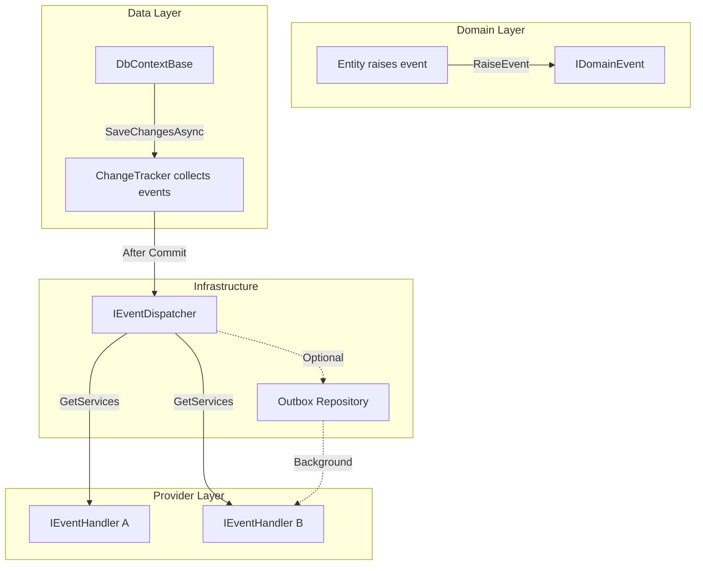
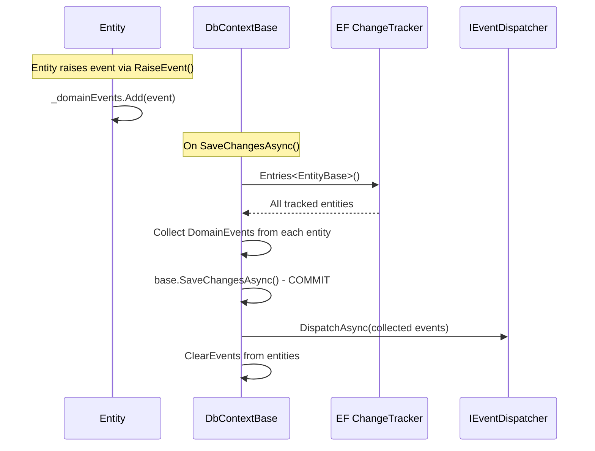
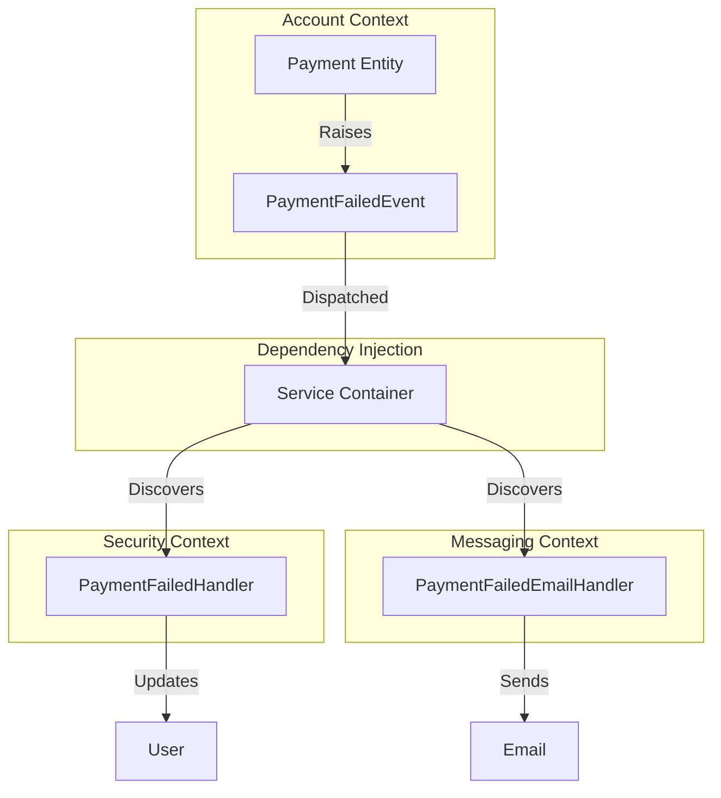
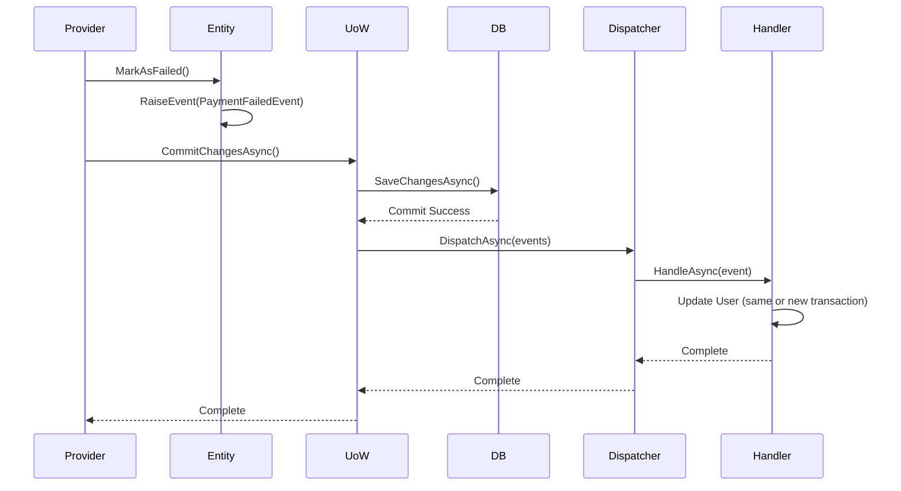
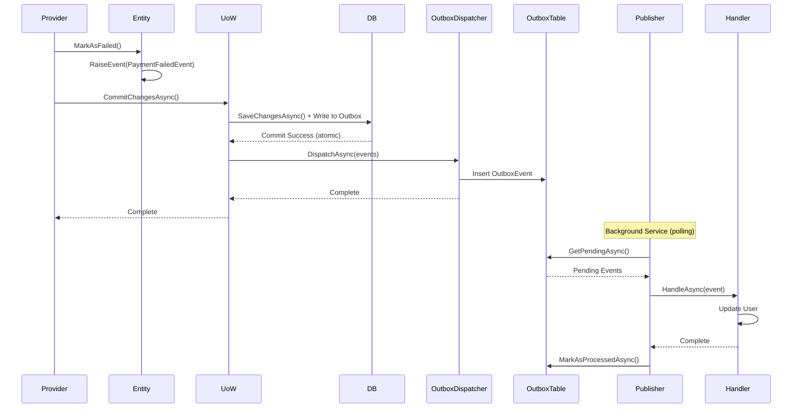
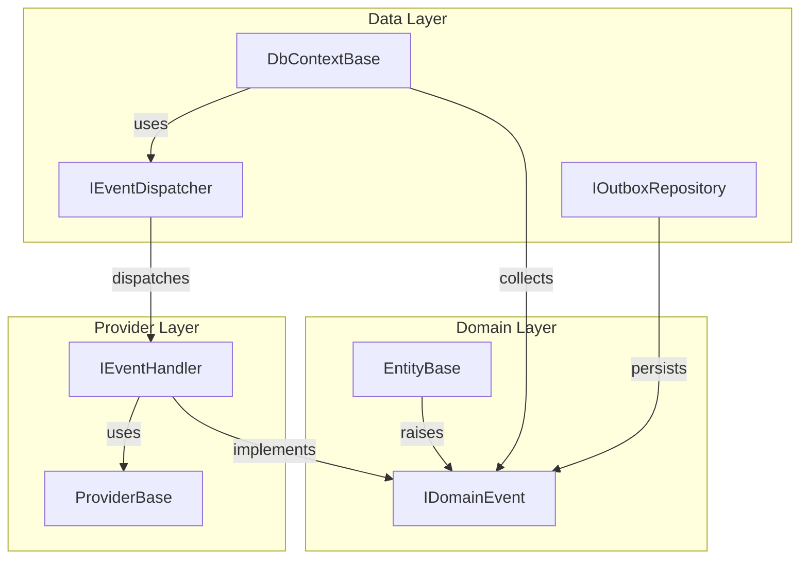

# RFC: Domain Events for Paradigm.Enterprise

- **RFC ID**: 2025-12-26-domain-events-and-services
- **Status**: Draft
- **Author(s)**: Paradigm Team
- **Created**: 2025-12-26
- **Last Updated**: 2025-12-26

## Summary

This RFC proposes adding **Domain Events** (both in-memory and persisted via outbox pattern) to the Paradigm.Enterprise framework. This will enable loosely-coupled cross-context communication within monolithic applications, allowing bounded contexts to react to domain events without direct provider-to-provider dependencies. The design maintains the framework's architectural principles: domain layer remains dependency-free, providers remain transient, and transactional semantics are clearly defined for both immediate and eventual consistency scenarios.

The solution supports two dispatch mechanisms: in-memory dispatch (synchronous, after commit) for same-context reactions, and an outbox pattern (asynchronous, eventual consistency) for cross-context reactions that require guaranteed delivery.

## Motivation

Currently, cross-context orchestration in Paradigm.Enterprise relies on direct provider-to-provider calls. For example, when a payment fails in the Account context, the `AccountProvider` directly calls `UserProvider` from the Security context to disable the user. This approach creates several problems:

1. **Tight Coupling**: Providers must know about and depend on other context providers, violating bounded context boundaries
2. **Testability**: Testing cross-context scenarios requires mocking multiple providers and understanding their interactions
3. **Extensibility**: Adding new reactions to domain events requires modifying existing provider code
4. **Transaction Boundaries**: Direct calls force all operations into a single transaction or require complex transaction management
5. **Audit Trail**: No explicit record of what events occurred and how the system reacted

**Real-World Scenario**: When `PaymentFailed` or `SubscriptionExpired` occurs in the Account context, the Security context should disable the user. When `PaymentReceived` occurs, the user should be re-enabled. Currently, this requires `AccountProvider` to directly call `UserProvider`, creating tight coupling.

By introducing Domain Events, we can:

- Decouple contexts: Account context emits events without knowing who consumes them
- Enable multiple handlers: Security, Messaging, and Analytics contexts can all react independently
- Improve testability: Test event raising and handling separately
- Support both immediate and eventual consistency: Choose dispatch mechanism based on requirements
- Provide audit trail: Events are explicit, traceable artifacts

## Quick Start

Here's the minimal code needed to use domain events:

**1. Define an Event:**

```csharp
// In Account.Domain assembly
public class PaymentFailedEvent : IntegrationEventBase
{
    public int UserId { get; }
    public string Reason { get; }

    public PaymentFailedEvent(int paymentId, int userId, string reason)
        : base(paymentId, "Account")
    {
        UserId = userId;
        Reason = reason;
    }
}
```

**2. Raise Event in Entity:**

```csharp
public class Payment : EntityBase<IPayment, Payment, PaymentView>
{
    public void MarkAsFailed(string reason)
    {
        Status = PaymentStatus.Failed;
        RaiseEvent(new PaymentFailedEvent(Id, UserId, reason));
    }
}
```

**3. Create Handler:**

```csharp
// In Security.Providers assembly
public class PaymentFailedHandler : IEventHandler<PaymentFailedEvent>
{
    private readonly IUserProvider _userProvider;

    public PaymentFailedHandler(IUserProvider userProvider)
    {
        _userProvider = userProvider;
    }

    public async Task HandleAsync(PaymentFailedEvent evt, CancellationToken cancellationToken = default)
    {
        await _userProvider.DeactivateAsync(evt.UserId, $"Payment failed: {evt.Reason}");
    }
}
```

**4. Register in DI:**

```csharp
// In Program.cs or Startup.cs
services.AddDomainEvents();
services.AddEventHandler<PaymentFailedEvent, PaymentFailedHandler>();
```

That's it! When `Payment.MarkAsFailed()` is called and the transaction commits, the handler will automatically be invoked.

## Detailed Design

### Architecture Overview

The Domain Events system follows a publish-subscribe pattern where entities raise events during business operations, events are collected by the Unit of Work, and dispatched to registered handlers after the transaction commits. The design maintains strict dependency rules: the domain layer defines events but has no infrastructure dependencies.



### Core Components

#### 1. Domain Event Base Classes

All domain events implement the `IDomainEvent` marker interface. Base classes provide common metadata:

```csharp
namespace Paradigm.Enterprise.Domain.Events
{
    /// <summary>
    /// Marker interface for all domain events
    /// </summary>
    public interface IDomainEvent
    {
        /// <summary>
        /// Unique identifier for this event instance
        /// </summary>
        Guid EventId { get; }

        /// <summary>
        /// Timestamp when the event occurred
        /// </summary>
        DateTime OccurredOn { get; }

        /// <summary>
        /// Identifier of the aggregate root that raised this event
        /// </summary>
        int AggregateId { get; }
    }

    /// <summary>
    /// Base class for domain events within a single bounded context
    /// </summary>
    public abstract class DomainEventBase : IDomainEvent
    {
        public Guid EventId { get; } = Guid.NewGuid();
        public DateTime OccurredOn { get; } = DateTime.UtcNow;
        public int AggregateId { get; protected set; }

        protected DomainEventBase(int aggregateId)
        {
            AggregateId = aggregateId;
        }
    }

    /// <summary>
    /// Base class for integration events that cross bounded context boundaries
    /// </summary>
    public abstract class IntegrationEventBase : DomainEventBase
    {
        /// <summary>
        /// Source context that raised this event (e.g., "Account", "Security")
        /// </summary>
        public string SourceContext { get; }

        protected IntegrationEventBase(int aggregateId, string sourceContext)
            : base(aggregateId)
        {
            SourceContext = sourceContext;
        }
    }
}
```

**Example Event Definitions:**

```csharp
// In Account.Domain assembly
namespace Account.Domain.Events
{
    public class PaymentFailedEvent : IntegrationEventBase
    {
        public int UserId { get; }
        public string Reason { get; }
        public decimal Amount { get; }

        public PaymentFailedEvent(int paymentId, int userId, string reason, decimal amount)
            : base(paymentId, "Account")
        {
            UserId = userId;
            Reason = reason;
            Amount = amount;
        }
    }

    public class PaymentReceivedEvent : IntegrationEventBase
    {
        public int UserId { get; }
        public decimal Amount { get; }

        public PaymentReceivedEvent(int paymentId, int userId, decimal amount)
            : base(paymentId, "Account")
        {
            UserId = userId;
            Amount = amount;
        }
    }

    public class SubscriptionExpiredEvent : IntegrationEventBase
    {
        public int UserId { get; }
        public DateTime ExpiredOn { get; }

        public SubscriptionExpiredEvent(int subscriptionId, int userId, DateTime expiredOn)
            : base(subscriptionId, "Account")
        {
            UserId = userId;
            ExpiredOn = expiredOn;
        }
    }
}
```

#### 2. Event Collection in EntityBase

Entities collect events in a private list and expose them via a read-only property. The `RaiseEvent` method is protected, allowing only the entity itself to raise events:

```csharp
// In Paradigm.Enterprise.Domain.Entities.EntityBase
namespace Paradigm.Enterprise.Domain.Entities
{
    public abstract class EntityBase : Interfaces.IEntity
    {
        [Key]
        public int Id { get; set; }

        public bool IsNew() => Id == default;

        // Domain Events infrastructure
        private readonly List<IDomainEvent> _domainEvents = new();

        /// <summary>
        /// Gets the domain events raised by this entity
        /// </summary>
        public IReadOnlyCollection<IDomainEvent> DomainEvents => _domainEvents.AsReadOnly();

        /// <summary>
        /// Raises a domain event. Only the entity itself can raise events.
        /// </summary>
        protected void RaiseEvent(IDomainEvent domainEvent)
        {
            if (domainEvent == null)
                throw new ArgumentNullException(nameof(domainEvent));

            _domainEvents.Add(domainEvent);
        }

        /// <summary>
        /// Clears all domain events. Called by UnitOfWork after dispatch.
        /// </summary>
        internal void ClearEvents()
        {
            _domainEvents.Clear();
        }
    }
}
```

**Example Entity Raising Events:**

```csharp
// In Account.Domain assembly
namespace Account.Domain.Entities
{
    public class Payment : EntityBase<IPayment, Payment, PaymentView>
    {
        public PaymentStatus Status { get; private set; }
        public int UserId { get; set; }
        public decimal Amount { get; set; }
        public string? FailureReason { get; private set; }

        public void MarkAsFailed(string reason)
        {
            Status = PaymentStatus.Failed;
            FailureReason = reason;
            RaiseEvent(new PaymentFailedEvent(Id, UserId, reason, Amount));
        }

        public void MarkAsReceived()
        {
            Status = PaymentStatus.Received;
            RaiseEvent(new PaymentReceivedEvent(Id, UserId, Amount));
        }

        public void MarkSubscriptionAsExpired(DateTime expiredOn)
        {
            Status = PaymentStatus.Expired;
            RaiseEvent(new SubscriptionExpiredEvent(Id, UserId, expiredOn));
        }
    }
}
```

#### 3. Event Dispatcher

The dispatcher interface abstracts the dispatch mechanism, allowing both in-memory and outbox implementations:

```csharp
namespace Paradigm.Enterprise.Domain.Events
{
    /// <summary>
    /// Dispatches domain events to registered handlers
    /// </summary>
    public interface IEventDispatcher
    {
        /// <summary>
        /// Dispatches events to all registered handlers
        /// </summary>
        Task DispatchAsync(IEnumerable<IDomainEvent> events, CancellationToken cancellationToken = default);
    }
}
```

**In-Memory Event Dispatcher:**

Dispatches events immediately after commit, within the same process. Handlers run in a new scoped context:

```csharp
namespace Paradigm.Enterprise.Data.Events
{
    public class InMemoryEventDispatcher : IEventDispatcher
    {
        private readonly IServiceProvider _serviceProvider;
        private readonly ILogger<InMemoryEventDispatcher> _logger;

        public InMemoryEventDispatcher(
            IServiceProvider serviceProvider,
            ILogger<InMemoryEventDispatcher> logger)
        {
            _serviceProvider = serviceProvider;
            _logger = logger;
        }

        public async Task DispatchAsync(IEnumerable<IDomainEvent> events, CancellationToken cancellationToken = default)
        {
            var eventsList = events.ToList();
            if (!eventsList.Any())
                return;

            // Create a new scope for handlers to ensure proper lifetime management
            using var scope = _serviceProvider.CreateScope();
            var scopedProvider = scope.ServiceProvider;

            foreach (var domainEvent in eventsList)
            {
                try
                {
                    await DispatchToHandlersAsync(scopedProvider, domainEvent, cancellationToken);
                }
                catch (Exception ex)
                {
                    _logger.LogError(ex,
                        "Error dispatching event {EventType} with ID {EventId}",
                        domainEvent.GetType().Name,
                        domainEvent.EventId);
                    // Continue with other events - don't fail entire batch
                }
            }
        }

        private async Task DispatchToHandlersAsync(
            IServiceProvider serviceProvider,
            IDomainEvent domainEvent,
            CancellationToken cancellationToken)
        {
            var eventType = domainEvent.GetType();
            var handlerType = typeof(IEventHandler<>).MakeGenericType(eventType);
            var handlers = serviceProvider.GetServices(handlerType);

            foreach (var handler in handlers)
            {
                await ((IEventHandler)handler).HandleAsync(domainEvent, cancellationToken);
            }
        }
    }
}
```

**Outbox Event Dispatcher:**

Writes events to the outbox table in the same transaction, then returns immediately. A background service publishes events asynchronously:

```csharp
namespace Paradigm.Enterprise.Data.Events
{
    public class OutboxEventDispatcher : IEventDispatcher
    {
        private readonly IOutboxEventRepository _outboxRepository;
        private readonly ILogger<OutboxEventDispatcher> _logger;

        public OutboxEventDispatcher(
            IOutboxEventRepository outboxRepository,
            ILogger<OutboxEventDispatcher> logger)
        {
            _outboxRepository = outboxRepository;
            _logger = logger;
        }

        public async Task DispatchAsync(IEnumerable<IDomainEvent> events, CancellationToken cancellationToken = default)
        {
            var eventsList = events.ToList();
            if (!eventsList.Any())
                return;

            foreach (var domainEvent in eventsList)
            {
                try
                {
                    var outboxEvent = new OutboxEvent
                    {
                        EventType = domainEvent.GetType().AssemblyQualifiedName,
                        PayloadJson = JsonSerializer.Serialize(domainEvent, domainEvent.GetType()),
                        CreatedDate = DateTime.UtcNow,
                        Status = OutboxEventStatus.Pending
                    };

                    await _outboxRepository.AddAsync(outboxEvent, cancellationToken);
                }
                catch (Exception ex)
                {
                    _logger.LogError(ex,
                        "Error writing event {EventType} to outbox",
                        domainEvent.GetType().Name);
                    throw; // Fail the transaction if we can't write to outbox
                }
            }
        }
    }
}
```

#### 4. Event Handlers

Handlers implement `IEventHandler<TEvent>` and are registered in the dependency injection container:

```csharp
namespace Paradigm.Enterprise.Domain.Events
{
    /// <summary>
    /// Non-generic base interface for event handlers, enabling dispatch without reflection
    /// </summary>
    public interface IEventHandler
    {
        /// <summary>
        /// Handles the domain event
        /// </summary>
        Task HandleAsync(IDomainEvent domainEvent, CancellationToken cancellationToken = default);
    }

    /// <summary>
    /// Handles a specific type of domain event
    /// </summary>
    public interface IEventHandler<in TEvent> : IEventHandler where TEvent : IDomainEvent
    {
        /// <summary>
        /// Handles the domain event (strongly typed)
        /// </summary>
        Task HandleAsync(TEvent domainEvent, CancellationToken cancellationToken = default);

        /// <summary>
        /// Explicit implementation routes non-generic calls to the typed method
        /// </summary>
        Task IEventHandler.HandleAsync(IDomainEvent domainEvent, CancellationToken cancellationToken)
            => HandleAsync((TEvent)domainEvent, cancellationToken);
    }
}
```

**Example Handler Implementation:**

```csharp
// In Account.Providers assembly (or Security.Providers)
namespace Account.Providers.Events
{
    public class PaymentFailedHandler : IEventHandler<PaymentFailedEvent>
    {
        private readonly IUserProvider _userProvider; // From Security context
        private readonly ILogger<PaymentFailedHandler> _logger;

        public PaymentFailedHandler(
            IUserProvider userProvider,
            ILogger<PaymentFailedHandler> logger)
        {
            _userProvider = userProvider;
            _logger = logger;
        }

        public async Task HandleAsync(PaymentFailedEvent evt, CancellationToken cancellationToken = default)
        {
            _logger.LogInformation(
                "Processing PaymentFailed event for Payment {PaymentId}, User {UserId}",
                evt.AggregateId,
                evt.UserId);

            // Handlers should delegate to provider methods rather than manipulating entities directly
            await _userProvider.DeactivateAsync(evt.UserId, $"Payment failed: {evt.Reason}");

            _logger.LogInformation("User {UserId} deactivated due to payment failure", evt.UserId);
        }
    }

    public class PaymentReceivedHandler : IEventHandler<PaymentReceivedEvent>
    {
        private readonly IUserProvider _userProvider;
        private readonly ILogger<PaymentReceivedHandler> _logger;

        public PaymentReceivedHandler(
            IUserProvider userProvider,
            ILogger<PaymentReceivedHandler> logger)
        {
            _userProvider = userProvider;
            _logger = logger;
        }

        public async Task HandleAsync(PaymentReceivedEvent evt, CancellationToken cancellationToken = default)
        {
            _logger.LogInformation(
                "Processing PaymentReceived event for Payment {PaymentId}, User {UserId}",
                evt.AggregateId,
                evt.UserId);

            // Handlers should delegate to provider methods rather than manipulating entities directly
            await _userProvider.ReactivateAsync(evt.UserId);

            _logger.LogInformation("User {UserId} reactivated after payment received", evt.UserId);
        }
    }
}
```

#### 5. How Event Collection Works

A critical question is: **How does `DbContextBase` know which entities have raised events?** The answer lies in Entity Framework Core's built-in `ChangeTracker` mechanism.

**The ChangeTracker Mechanism:**

Entity Framework Core automatically tracks all entities that are:

- Queried from the database (via `DbSet<T>` queries)
- Added to the context (via `Add` or `AddAsync`)
- Modified (via `Update` or when properties change on tracked entities)

The `ChangeTracker.Entries<T>()` method returns all tracked entities of type `T` or its subclasses. This is the **same mechanism** already used in `DbContextBase` for auditing (see line 85 in the existing implementation).

**Event Collection Flow:**



**Key Points:**

1. **Automatic Discovery:** `ChangeTracker.Entries<EntityBase>()` automatically finds all tracked entities that inherit from `EntityBase`, without requiring explicit registration or configuration.

2. **Same Pattern as Auditing:** This follows the exact same pattern as the existing audit functionality in `DbContextBase.SaveChangesAsync()`, which uses `ChangeTracker.Entries<IAuditableEntity>()` to find auditable entities.

3. **Timing:** Events are collected **BEFORE** `SaveChangesAsync()` is called, ensuring all events raised during the transaction are captured. Events are dispatched **AFTER** the transaction commits successfully.

4. **No Additional Overhead:** Since EF Core already tracks these entities for change detection, there's no additional performance cost to iterate through them.

#### 6. Unit of Work Integration

The `DbContextBase` collects events from all tracked entities before saving, commits the transaction, then dispatches events:

```csharp
// In Paradigm.Enterprise.Data.Context.DbContextBase
namespace Paradigm.Enterprise.Data.Context
{
    public class DbContextBase : DbContext, ICommiteable
    {
        private readonly IServiceProvider _serviceProvider;
        private IEventDispatcher? _eventDispatcher;

        // ... existing code ...

        public override async Task<int> SaveChangesAsync(CancellationToken cancellationToken = default)
        {
            // Collect events from all tracked entities BEFORE saving
            var events = CollectDomainEvents();

            // Perform audit operations (existing code)
            IEntity? loggedUser = null;
            foreach (var entry in ChangeTracker.Entries<IAuditableEntity>())
            {
                loggedUser = loggedUser ?? _serviceProvider.GetRequiredService<ILoggedUserService>().TryGetAuthenticatedUser<IEntity>();
                if (loggedUser is null) continue;

                switch (entry.State)
                {
                    case EntityState.Added:
                    case EntityState.Modified:
                        AuditEntity(entry.Entity, loggedUser.Id);
                        break;
                }
            }

            // Save changes to database
            var result = await base.SaveChangesAsync(cancellationToken);

            // Dispatch events AFTER successful commit
            if (events.Any())
            {
                _eventDispatcher ??= _serviceProvider.GetRequiredService<IEventDispatcher>();
                await _eventDispatcher.DispatchAsync(events, cancellationToken);

                // Clear events from entities after dispatch
                ClearDomainEvents();
            }

            return result;
        }

        private List<IDomainEvent> CollectDomainEvents()
        {
            var events = new List<IDomainEvent>();

            foreach (var entry in ChangeTracker.Entries<EntityBase>())
            {
                if (entry.Entity is EntityBase entity)
                {
                    events.AddRange(entity.DomainEvents);
                }
            }

            return events;
        }

        private void ClearDomainEvents()
        {
            foreach (var entry in ChangeTracker.Entries<EntityBase>())
            {
                if (entry.Entity is EntityBase entity)
                {
                    entity.ClearEvents();
                }
            }
        }
    }
}
```

#### 6. How Handler Discovery Works

A key benefit of the domain events pattern is **lazy handler discovery** - handlers are discovered at dispatch time, not eagerly configured. This enables true decoupling between event publishers and subscribers.

**The Discovery Mechanism:**

When an event is dispatched, the `InMemoryEventDispatcher` uses reflection and dependency injection to discover all handlers for that event type:

```csharp
// Inside InMemoryEventDispatcher.DispatchToHandlersAsync()
var eventType = domainEvent.GetType();
var handlerType = typeof(IEventHandler<>).MakeGenericType(eventType);
var handlers = serviceProvider.GetServices(handlerType);
```

**How It Works:**

1. **Handler Registration:** Handlers implement `IEventHandler<TEvent>` and are registered in the DI container (either explicitly or via assembly scanning).

2. **Runtime Discovery:** At dispatch time, the dispatcher:
   - Gets the concrete event type (e.g., `PaymentFailedEvent`)
   - Constructs the handler interface type (e.g., `IEventHandler<PaymentFailedEvent>`)
   - Asks the DI container for **all** registered implementations of that interface

3. **Lazy Coupling:** The Account context that raises `PaymentFailedEvent` doesn't need to know:
   - How many handlers exist
   - Which contexts provide handlers
   - What those handlers do

#### Example: Cross-Context Communication Without Coupling



**Key Benefits:**

- **No Eager Configuration:** Handlers don't need to be registered upfront in a central location. Each bounded context registers its own handlers independently.

- **Extensibility:** New handlers can be added by simply:
  1. Creating a class implementing `IEventHandler<TEvent>`
  2. Registering it in DI
  3. No changes needed to existing code

- **True Decoupling:** The Account context (publisher) and Security context (subscriber) only share the event definition. They don't reference each other's assemblies.

- **Multiple Handlers:** Multiple handlers can react to the same event, each in their own bounded context, without coordination.

**Registration Example:**

```csharp
// In Account.Providers assembly - no reference to Security context needed
services.AddEventHandler<PaymentFailedEvent, PaymentFailedHandler>();

// In Security.Providers assembly - no reference to Account context needed
services.AddEventHandler<PaymentFailedEvent, UserDeactivationHandler>();

// Both handlers will be discovered when PaymentFailedEvent is dispatched
```

#### 7. Outbox Pattern Implementation

**Outbox Event Entity:**

```csharp
namespace Paradigm.Enterprise.Data.Events
{
    public class OutboxEvent : EntityBase
    {
        /// <summary>
        /// Fully qualified type name of the event
        /// </summary>
        public string EventType { get; set; } = string.Empty;

        /// <summary>
        /// Serialized JSON payload of the event
        /// </summary>
        public string PayloadJson { get; set; } = string.Empty;

        /// <summary>
        /// When the event was created
        /// </summary>
        public DateTime CreatedDate { get; set; } = DateTime.UtcNow;

        /// <summary>
        /// When the event was processed (null if pending)
        /// </summary>
        public DateTime? ProcessedDate { get; set; }

        /// <summary>
        /// Current status of the event
        /// </summary>
        public OutboxEventStatus Status { get; set; } = OutboxEventStatus.Pending;

        /// <summary>
        /// Number of processing attempts
        /// </summary>
        public int RetryCount { get; set; }

        /// <summary>
        /// Error message if processing failed
        /// </summary>
        public string? ErrorMessage { get; set; }
    }

    public enum OutboxEventStatus
    {
        Pending = 0,
        Processing = 1,
        Processed = 2,
        Failed = 3
    }
}
```

**Outbox Repository Interface:**

```csharp
namespace Paradigm.Enterprise.Data.Events
{
    public interface IOutboxEventRepository
    {
        Task AddAsync(OutboxEvent outboxEvent, CancellationToken cancellationToken = default);
        Task<IEnumerable<OutboxEvent>> GetPendingAsync(int batchSize = 100, CancellationToken cancellationToken = default);
        Task MarkAsProcessingAsync(int outboxEventId, CancellationToken cancellationToken = default);
        Task MarkAsProcessedAsync(int outboxEventId, CancellationToken cancellationToken = default);
        Task MarkAsFailedAsync(int outboxEventId, string errorMessage, CancellationToken cancellationToken = default);
    }
}
```

**Outbox Publisher Service:**

A background service that polls the outbox table and dispatches events:

```csharp
namespace Paradigm.Enterprise.Data.Events
{
    public class OutboxPublisherService : BackgroundService
    {
        private readonly IOutboxEventRepository _outboxRepository;
        private readonly IServiceProvider _serviceProvider;
        private readonly ILogger<OutboxPublisherService> _logger;
        private readonly TimeSpan _pollingInterval;
        private readonly int _batchSize;

        public OutboxPublisherService(
            IOutboxEventRepository outboxRepository,
            IServiceProvider serviceProvider,
            ILogger<OutboxPublisherService> logger,
            IConfiguration configuration)
        {
            _outboxRepository = outboxRepository;
            _serviceProvider = serviceProvider;
            _logger = logger;
            _pollingInterval = TimeSpan.FromSeconds(
                configuration.GetValue<int>("DomainEvents:Outbox:PollingIntervalSeconds", 5));
            _batchSize = configuration.GetValue<int>("DomainEvents:Outbox:BatchSize", 100);
        }

        protected override async Task ExecuteAsync(CancellationToken stoppingToken)
        {
            _logger.LogInformation("Outbox Publisher Service started");

            while (!stoppingToken.IsCancellationRequested)
            {
                try
                {
                    await ProcessPendingEventsAsync(stoppingToken);
                }
                catch (Exception ex)
                {
                    _logger.LogError(ex, "Error processing outbox events");
                }

                await Task.Delay(_pollingInterval, stoppingToken);
            }

            _logger.LogInformation("Outbox Publisher Service stopped");
        }

        private async Task ProcessPendingEventsAsync(CancellationToken cancellationToken)
        {
            var pendingEvents = await _outboxRepository.GetPendingAsync(_batchSize, cancellationToken);
            var eventsList = pendingEvents.ToList();

            if (!eventsList.Any())
                return;

            _logger.LogDebug("Processing {Count} pending outbox events", eventsList.Count);

            foreach (var outboxEvent in eventsList)
            {
                try
                {
                    await ProcessEventAsync(outboxEvent, cancellationToken);
                }
                catch (Exception ex)
                {
                    _logger.LogError(ex,
                        "Error processing outbox event {EventId} of type {EventType}",
                        outboxEvent.Id,
                        outboxEvent.EventType);

                    await _outboxRepository.MarkAsFailedAsync(
                        outboxEvent.Id,
                        ex.Message,
                        cancellationToken);
                }
            }
        }

        private async Task ProcessEventAsync(OutboxEvent outboxEvent, CancellationToken cancellationToken)
        {
            // Mark as processing to prevent concurrent processing
            await _outboxRepository.MarkAsProcessingAsync(outboxEvent.Id, cancellationToken);

            // Deserialize the event
            var eventType = Type.GetType(outboxEvent.EventType);
            if (eventType == null)
            {
                throw new InvalidOperationException($"Cannot resolve event type: {outboxEvent.EventType}");
            }

            var domainEvent = JsonSerializer.Deserialize(outboxEvent.PayloadJson, eventType) as IDomainEvent;
            if (domainEvent == null)
            {
                throw new InvalidOperationException($"Failed to deserialize event: {outboxEvent.EventType}");
            }

            // Dispatch to handlers using in-memory dispatcher
            using var scope = _serviceProvider.CreateScope();
            var dispatcher = scope.ServiceProvider.GetRequiredService<InMemoryEventDispatcher>();
            await dispatcher.DispatchAsync(new[] { domainEvent }, cancellationToken);

            // Mark as processed
            await _outboxRepository.MarkAsProcessedAsync(outboxEvent.Id, cancellationToken);

            _logger.LogDebug("Successfully processed outbox event {EventId}", outboxEvent.Id);
        }
    }
}
```

**Outbox Table Schema (SQL Server):**

```sql
CREATE TABLE [dbo].[DomainEventOutbox]
(
    [Id] INT IDENTITY(1,1) PRIMARY KEY,
    [EventType] NVARCHAR(500) NOT NULL,
    [PayloadJson] NVARCHAR(MAX) NOT NULL,
    [CreatedDate] DATETIME2 NOT NULL DEFAULT GETUTCDATE(),
    [ProcessedDate] DATETIME2 NULL,
    [Status] INT NOT NULL DEFAULT 0, -- 0=Pending, 1=Processing, 2=Processed, 3=Failed
    [RetryCount] INT NOT NULL DEFAULT 0,
    [ErrorMessage] NVARCHAR(MAX) NULL
);

CREATE INDEX [IX_DomainEventOutbox_Status_CreatedDate]
ON [dbo].[DomainEventOutbox] ([Status], [CreatedDate]);
```

#### 8. Handler Registration

**Extension Methods for Registration:**

```csharp
namespace Paradigm.Enterprise.Providers.Extensions
{
    public static class DomainEventsExtensions
    {
        /// <summary>
        /// Adds domain events infrastructure with in-memory dispatch
        /// </summary>
        public static IServiceCollection AddDomainEvents(
            this IServiceCollection services,
            Action<DomainEventsOptions>? configure = null)
        {
            var options = new DomainEventsOptions();
            configure?.Invoke(options);

            // Register dispatcher based on configuration
            if (options.UseOutbox)
            {
                services.AddScoped<IEventDispatcher, OutboxEventDispatcher>();
                services.AddScoped<IOutboxEventRepository, options.OutboxRepositoryType>();
                services.AddHostedService<OutboxPublisherService>();
            }
            else
            {
                services.AddScoped<IEventDispatcher, InMemoryEventDispatcher>();
            }

            return services;
        }

        /// <summary>
        /// Registers an event handler explicitly
        /// </summary>
        public static IServiceCollection AddEventHandler<TEvent, THandler>(
            this IServiceCollection services)
            where TEvent : IDomainEvent
            where THandler : class, IEventHandler<TEvent>
        {
            services.AddScoped<IEventHandler<TEvent>, THandler>();
            return services;
        }

        /// <summary>
        /// Scans assemblies for event handlers and registers them automatically
        /// </summary>
        public static IServiceCollection ScanForEventHandlers(
            this IServiceCollection services,
            params Assembly[] assemblies)
        {
            foreach (var assembly in assemblies)
            {
                var handlerTypes = assembly.GetTypes()
                    .Where(t => !t.IsAbstract && !t.IsInterface)
                    .Where(t => t.GetInterfaces()
                        .Any(i => i.IsGenericType &&
                                  i.GetGenericTypeDefinition() == typeof(IEventHandler<>)))
                    .ToList();

                foreach (var handlerType in handlerTypes)
                {
                    var interfaceType = handlerType.GetInterfaces()
                        .First(i => i.IsGenericType &&
                                   i.GetGenericTypeDefinition() == typeof(IEventHandler<>));

                    services.AddScoped(interfaceType, handlerType);
                }
            }

            return services;
        }
    }

    public class DomainEventsOptions
    {
        public bool UseOutbox { get; set; }
        public Type? OutboxRepositoryType { get; set; }
        public int PollingIntervalSeconds { get; set; } = 5;
        public int BatchSize { get; set; } = 100;
    }
}
```

**Registration Examples:**

```csharp
// In Program.cs or Startup.cs

// Option 1: In-memory dispatch with explicit handler registration
services.AddDomainEvents();
services.AddEventHandler<PaymentFailedEvent, PaymentFailedHandler>();
services.AddEventHandler<PaymentReceivedEvent, PaymentReceivedHandler>();

// Option 2: In-memory dispatch with convention-based scanning
services.AddDomainEvents();
services.ScanForEventHandlers(typeof(PaymentFailedHandler).Assembly);

// Option 3: Outbox pattern with explicit handlers
services.AddDomainEvents(options =>
{
    options.UseOutbox = true;
    options.OutboxRepositoryType = typeof(SqlServerOutboxEventRepository);
    options.PollingIntervalSeconds = 5;
    options.BatchSize = 100;
});
services.AddEventHandler<PaymentFailedEvent, PaymentFailedHandler>();
services.AddEventHandler<PaymentReceivedEvent, PaymentReceivedHandler>();
```

### Transactional Semantics

Understanding transaction boundaries is critical for correct event handling:

#### In-Memory Dispatch (Same Transaction Context)



**Key Points:**

- Events are dispatched **AFTER** `SaveChangesAsync` completes successfully
- Handlers run in a **NEW scoped context** for proper DI lifetime management
- **With explicit outer transaction** (Unit of Work pattern): Handlers participate in the same transaction. If a handler fails, everything can roll back—achieving atomic all-or-nothing behavior.
- **Without explicit outer transaction**: `SaveChangesAsync` auto-commits, handlers use their own transaction, and handler failures don't affect already-committed data. In this case, handlers should be **idempotent** or use compensating actions.
- This provides **immediate consistency** within the same process

#### Outbox Pattern (Eventual Consistency)



**Key Points:**

- Events are written to outbox table in the **SAME transaction** as business data
- Background publisher dispatches events **asynchronously**
- Provides **guaranteed delivery** and **at-least-once semantics**
- Handlers may receive the same event multiple times (idempotency required)
- This provides **eventual consistency** for cross-context reactions

#### What Can Be Included in the Same Transaction

**Same Database, In-Memory Dispatch:**

- ✅ Business entity changes + event raising
- ✅ Handler execution CAN participate in the same transaction if an explicit transaction is started at the Unit of Work level (e.g., via `TransactionScope` or `BeginTransaction`)
- ⚠️ Without an explicit outer transaction, handlers run after auto-commit and use their own transaction

**Same Database, Outbox Pattern:**

- ✅ Business entity changes + outbox record insertion
- ❌ Handler execution (runs asynchronously)

**Different Databases:**

- ❌ Cannot guarantee atomicity without distributed transactions
- ✅ Must use outbox pattern or message bus
- ✅ Eventual consistency is the only option

### Dependency Rules

The design maintains strict dependency boundaries:



**Domain Layer Rules:**

- ✅ Can define `IDomainEvent` implementations
- ✅ Can raise events via `RaiseEvent()`
- ❌ **CANNOT** reference provider assemblies
- ❌ **CANNOT** reference infrastructure (EF Core, serialization)
- ❌ **CANNOT** implement event handlers

**Provider Layer Rules:**

- ✅ Can implement `IEventHandler<TEvent>`
- ✅ Can call other providers via `GetProvider<T>()`
- ✅ Can access infrastructure (repositories, UoW)

**Data Layer Rules:**

- ✅ Collects events from entities
- ✅ Dispatches events via `IEventDispatcher`
- ✅ Manages outbox persistence
- ❌ No domain logic

## Alternatives Considered

### MediatR Library

**Approach:** Use the popular MediatR library for in-process messaging.

**Advantages:**

- Battle-tested, widely used
- Rich feature set (request/response, notifications, behaviors)
- Good documentation and community support

**Disadvantages:**

- Adds external dependency to the framework
- Less control over dispatch timing relative to transactions
- Designed for request/response patterns, not just events
- May be overkill for simple event dispatching
- MediatR is a paid library

**Why Not Chosen:** We want full control over when events are dispatched relative to transaction commits, and we prefer to keep the framework dependency-free where possible. MediatR's notification pattern is close, but doesn't integrate as cleanly with EF Core's `SaveChangesAsync`.

### Message Bus (Azure Service Bus, RabbitMQ)

**Approach:** Use an external message bus for all cross-context communication.

**Advantages:**

- True decoupling between services
- Built-in retry and dead-letter queue support
- Can scale to microservices architecture later
- Guaranteed delivery

**Disadvantages:**

- Over-engineering for monolithic applications
- Introduces network latency and potential failure points
- Requires infrastructure setup and maintenance
- More complex deployment and testing
- Not suitable for same-context, immediate reactions

**Why Not Chosen (for now):** The framework targets monolithic applications first. Adding message bus infrastructure adds unnecessary complexity for most use cases today. The outbox pattern provides similar guarantees without external dependencies.

**Future Extensibility:** The `IEventDispatcher` abstraction is designed to support additional dispatch mechanisms. When cross-system communication is needed, we can implement `AzureServiceBusEventDispatcher`, `RabbitMqEventDispatcher`, or similar without changing existing code. Applications would simply register the appropriate dispatcher implementation based on their infrastructure needs.

### Synchronous Provider Calls (Current Approach)

**Approach:** Continue with direct provider-to-provider calls.

**Advantages:**

- Simple, straightforward
- Immediate consistency
- Easy to debug (linear call stack)
- No new infrastructure needed

**Disadvantages:**

- Tight coupling between contexts
- Difficult to test in isolation
- Hard to extend (must modify existing code)
- Forces all operations into single transaction or complex transaction management
- No audit trail of events

**Why Not Chosen:** This is the problem we're solving. While it works, it violates bounded context boundaries and makes the system harder to maintain and extend.

### Immediate Event Dispatch (Before Commit)

**Approach:** Dispatch events immediately when raised, before transaction commit.

**Advantages:**

- Handlers can participate in the same transaction
- True atomicity across event and handler execution
- Immediate consistency

**Disadvantages:**

- If handler fails, entire transaction rolls back (may not be desired)
- Handlers must be synchronous or carefully managed
- Risk of infinite loops if handlers raise new events
- Less flexible - can't choose eventual consistency when needed

**Why Not Chosen:** We prefer to commit business data first, then dispatch events. This ensures business operations succeed even if event handlers fail. Handlers can be made idempotent and retried if needed.

### Domain Events in Separate Assembly

**Approach:** Put all event infrastructure in a separate `Paradigm.Enterprise.Domain.Events` assembly.

**Advantages:**

- Clear separation of concerns
- Can version events independently

**Disadvantages:**

- Additional assembly to manage
- More complex dependency graph
- Events are core domain concepts, should be in domain layer

**Why Not Chosen:** Events are fundamental domain concepts. Keeping them in the domain layer maintains simplicity and aligns with DDD principles.

## Testing Strategy

### Unit Tests

Test entities raise events correctly and handlers process them as expected. Use mocks for dependencies to isolate behavior.

**Example - Entity Event Raising:**

```csharp
[Fact]
public void MarkAsFailed_RaisesPaymentFailedEvent()
{
    var payment = new Payment { Id = 1, UserId = 100 };
    payment.MarkAsFailed("Insufficient funds");

    payment.DomainEvents.Should().ContainSingle(e => e is PaymentFailedEvent);
}
```

**Example - Handler Testing:**

```csharp
[Fact]
public async Task PaymentFailedHandler_CallsProviderToDeactivateUser()
{
    var mockUserProvider = new Mock<IUserProvider>();
    var handler = new PaymentFailedHandler(mockUserProvider.Object, Mock.Of<ILogger<PaymentFailedHandler>>());

    await handler.HandleAsync(new PaymentFailedEvent(1, 100, "Insufficient funds", 50m));

    mockUserProvider.Verify(p => p.DeactivateAsync(100, "Payment failed: Insufficient funds"), Times.Once);
}
```

### Integration Tests

Test the full event flow end-to-end with a real database and DI container. In-memory dispatch is synchronous, so handlers execute immediately after commit. For outbox pattern, use polling or test doubles that process synchronously.

### Performance Considerations

- Event collection overhead: Minimal (uses existing ChangeTracker)
- Handler execution: Runs in separate scope/transaction, doesn't block original request
- Outbox throughput: Configurable via batch size and polling interval

## Rollout Plan

### Phase 1: Core Infrastructure

- Add `Paradigm.Enterprise.Domain.Events` namespace with base interfaces and classes
- Update `EntityBase` to support event collection (`RaiseEvent`, `DomainEvents`, `ClearEvents`)

### Phase 2: Dispatchers

- Implement `InMemoryEventDispatcher` and `OutboxEventDispatcher`
- Create `OutboxEvent` entity and `IOutboxEventRepository` interface
- Implement `OutboxPublisherService` background service
- Update `DbContextBase` to collect and dispatch events in `SaveChangesAsync`

### Phase 3: Registration & Configuration

- Add `DomainEventsExtensions` with `AddDomainEvents()` and handler registration methods

### Phase 4: SQL Server Outbox Implementation

- Implement `SqlServerOutboxEventRepository`
- Create database migration for `DomainEventOutbox` table

### Phase 5: Documentation & Examples

- Update framework documentation with domain events usage
- Create example application demonstrating cross-context events
- Add migration guide for existing provider-to-provider calls

### Phase 6: Testing

- Unit tests for event infrastructure
- Integration tests for full event flow
- Performance benchmarks

### Backward Compatibility

- **EntityBase changes:** Adding `DomainEvents` property and `RaiseEvent` method is non-breaking (new functionality)
- **DbContextBase changes:** Event collection is transparent to existing code
- **New dependencies:** All new components are opt-in via `AddDomainEvents()` extension method
- **Existing code:** Continues to work without modification

## Dependencies

### Framework Dependencies

- **Entity Framework Core:** Already used, no new dependency. Required for `ChangeTracker` to collect events from entities.
- **System.Text.Json:** Already in framework. Required for outbox payload serialization.
- **Microsoft.Extensions.Hosting:** Built into ASP.NET Core. Required for `BackgroundService` (outbox publisher).
- **Microsoft.Extensions.DependencyInjection:** Already used. Required for handler resolution.

### External Dependencies

**None.** The design intentionally avoids external dependencies to keep the framework lightweight and maintainable.

### Other RFCs

**None.** This RFC is self-contained.


## Open Questions (Resolved)

1. **Event Versioning:** *`Resolved`* Event versioning is only needed when events travel across microservices or multiple external systems. For events within the same system—even across bounded contexts—versioning is not required. We can explore versioning in a future RFC if cross-system integration becomes necessary.

2. **Cascading Events:** *`Resolved`* Handlers will **not** emit new events directly. Handlers should not contain business logic; they act as intermediaries that call providers, and providers call the domain. The domain may raise additional events during its operations, but this is controlled and predictable. For scenarios where two entities could create a closed circuit of events, we can implement a short-circuit mechanism to detect and break cycles.

3. **Event Types:** *`Resolved`* Start simple with just `IDomainEvent`. Keep notes for potential future event types:
   - `INotificationEvent` (fire-and-forget, non-critical)
   - `ICommandEvent` (critical, must succeed)
   - `IAuditEvent` (for compliance/logging purposes)

   Implementation approach: Add marker interfaces that inherit from `IDomainEvent`, and dispatchers can check for these interfaces to apply different handling strategies (e.g., retry policies, delivery guarantees).

4. **Outbox Retry Policy:** *`Resolved`* Configurable with sensible defaults (3 retries with exponential backoff). Applications can override via configuration.

5. **Event Ordering:** *`Resolved`* Order events as much as possible. Process by `CreatedDate` order within batches. Note that strict global ordering cannot be guaranteed when handlers run in parallel, but within a single aggregate's events, ordering should be preserved.

6. **Handler Transaction Management:** *`Resolved`* Handlers must **not** know about transactions or database contexts. Handlers are mere intermediaries—they receive events and delegate to providers. The provider layer manages transactions and persistence. This keeps handlers simple, testable, and focused on orchestration.

7. **Performance Impact:** *`Resolved`* Keep the implementation as small and fast as possible. For most scenarios, prefer in-memory dispatch over event queues—it has lower latency and simpler operational characteristics. Reserve the outbox pattern for scenarios that specifically require guaranteed delivery or eventual consistency. Performance benchmarks will be conducted during testing phase.

## References

- [Domain-Driven Design: Tackling Complexity in the Heart of Software](https://www.domainlanguage.com/ddd/) - Eric Evans
- [Implementing Domain-Driven Design](https://www.domainlanguage.com/ddd/) - Vaughn Vernon
- [Domain Events - Martin Fowler](https://martinfowler.com/eaaDev/DomainEvent.html)
- [The Outbox Pattern](https://www.kamilgrzybek.com/blog/the-outbox-pattern) - Kamil Grzybek
- [Event Sourcing](https://martinfowler.com/eaaDev/EventSourcing.html) - Martin Fowler
- [.NET Microservices: Architecture for Containerized .NET Applications - Domain Events](https://learn.microsoft.com/en-us/dotnet/architecture/microservices/microservice-ddd-cqrs-patterns/domain-events-design-implementation)
- [Entity Framework Core Change Tracking](https://learn.microsoft.com/en-us/ef/core/change-tracking/)
- [ASP.NET Core Background Services](https://learn.microsoft.com/en-us/aspnet/core/fundamentals/host/hosted-services)
