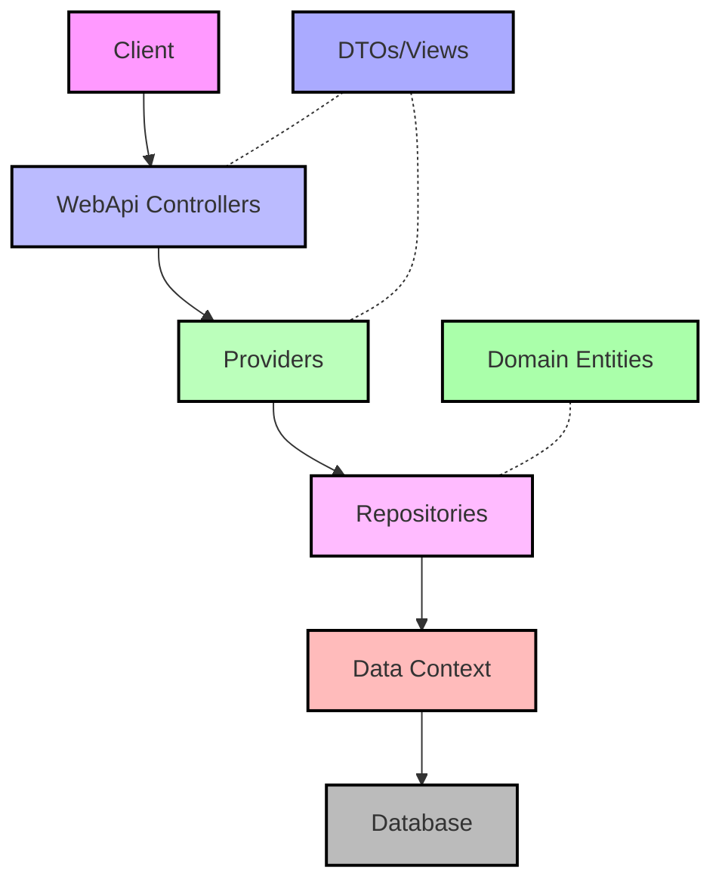
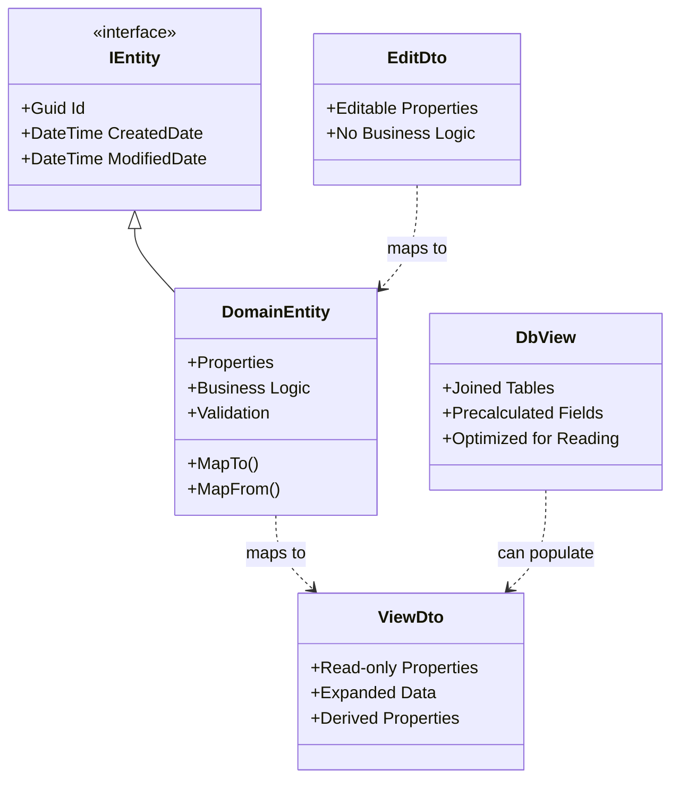
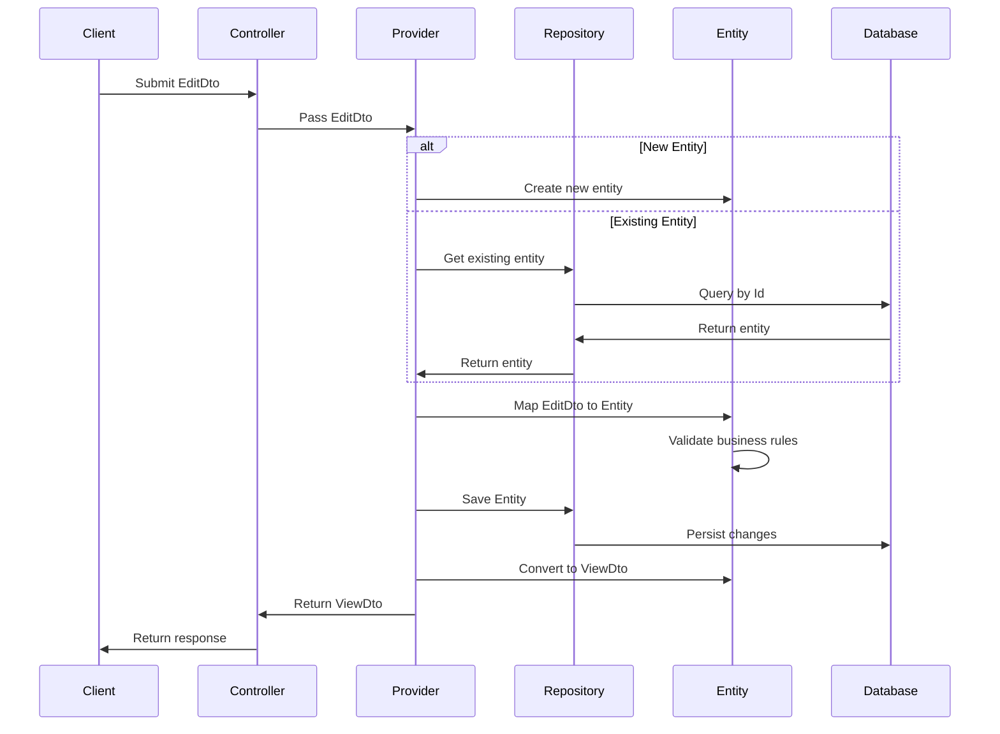
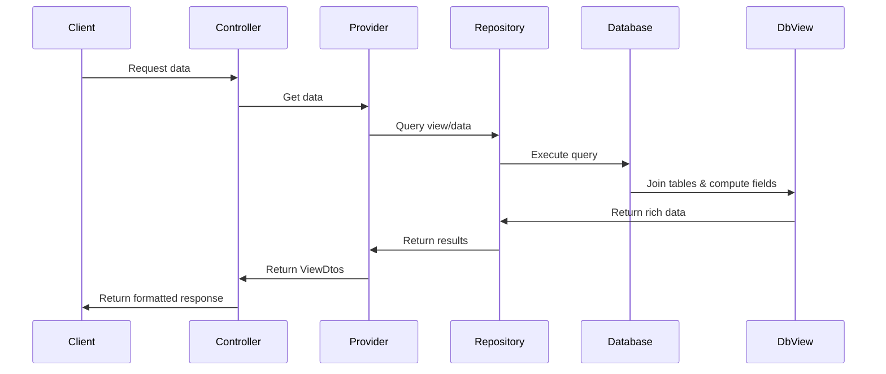

# 🔥 Building Apps with Paradigm.Enterprise: The Ultimate Guide

Hey there, developer! Let's dive into how Paradigm.Enterprise can transform your development workflow with a clean, layered architecture. You can find the complete working example in our [example folder](../example/):

## 🚀 Getting Started in 60 Seconds

### Step 1: Create the Solution

```bash
# Create a new solution
dotnet new sln -n ExampleApp

# Add projects for each layer
dotnet new classlib -n ExampleApp.Interfaces
dotnet new classlib -n ExampleApp.Domain
dotnet new classlib -n ExampleApp.Data
dotnet new classlib -n ExampleApp.Providers
dotnet new webapi -n ExampleApp.WebApi

# Add projects to solution
dotnet sln add ExampleApp.Interfaces
dotnet sln add ExampleApp.Domain
dotnet sln add ExampleApp.Data
dotnet sln add ExampleApp.Providers
dotnet sln add ExampleApp.WebApi
```

### Step 2: Install NuGet Packages

```bash
# Install Paradigm.Enterprise packages in each project
dotnet add ExampleApp.Interfaces package Paradigm.Enterprise.Interfaces
dotnet add ExampleApp.Domain package Paradigm.Enterprise.Domain
dotnet add ExampleApp.Data package Paradigm.Enterprise.Data
dotnet add ExampleApp.Providers package Paradigm.Enterprise.Providers
dotnet add ExampleApp.WebApi package Paradigm.Enterprise.WebApi

# Add project references
dotnet add ExampleApp.Domain reference ExampleApp.Interfaces
dotnet add ExampleApp.Data reference ExampleApp.Domain
dotnet add ExampleApp.Providers reference ExampleApp.Data
dotnet add ExampleApp.WebApi reference ExampleApp.Providers
```

## 🏗️ Understanding the Architecture

The Paradigm.Enterprise framework is built around a clean, layered architecture that separates concerns and promotes maintainability. Here's a visual representation of the architecture:



### Understanding Data Flow and Object Types

In the Paradigm.Enterprise framework, data flows through several distinct types of objects, each with a specific purpose:

#### Object Types in the Architecture



#### Data Flow During Create/Update Operation

Here's how data flows through the system when creating or updating an entity:



#### Data Flow for Read Operations with Views

A key optimization is using database views for complex read operations:



## 🧩 The Role of Each Object Type

Let's clarify the purpose of each type of object in the system:

### Domain Entities

- Core business objects with data and behavior
- Implement business rules and validation logic
- Protected from external manipulation
- Enforce data integrity
- Only accessible within the system's internal layers
- Example: A `Product` with validation rules for price and inventory

### Entity Interfaces

- Define the contract for entities
- Allow interaction without exposing implementation details
- Enable loose coupling and dependency injection
- Make testing easier with mock implementations
- Example: `IProduct` defining common properties accessible across layers

### ViewDtos

- Read-only representation of data for clients
- May include calculated or derived properties
- Tailored for specific UI requirements
- Can include data from multiple entities
- Example: `ProductView` with product information and availability status

### Database Views

- Optimized for read-heavy operations
- Combine data from multiple tables with joins
- Reduce roundtrips to the database
- Better performance for complex data retrieval
- Example: `ProductView` that includes product category name, supplier info, etc.

## 🏗️ Building Your App Layer by Layer

Let's build a product catalog application using the Paradigm.Enterprise framework, following the same approach as our example folder:

### 1️⃣ Define Your Interfaces

Start by defining your entity interfaces and DTOs:

```csharp
// ExampleApp.Interfaces/Inventory/IProduct.cs
using Paradigm.Enterprise.Interfaces;

namespace ExampleApp.Interfaces.Inventory;

public interface IProduct : IEntity
{
    DateTime CreatedDate { get; set; }
    DateTime ModifiedDate { get; set; }
    string Name { get; set; }
    decimal Price { get; set; }
    string Description { get; set; }
    string Category { get; set; }
    int StockQuantity { get; set; }
    bool IsAvailable { get; set; }
}
```

### 2️⃣ Create Your Domain Entities

Next, implement your domain entities with validation rules:

```csharp
// ExampleApp.Domain/Inventory/Entities/Product.cs
using System.ComponentModel.DataAnnotations;
using ExampleApp.Interfaces.Inventory;
using Microsoft.Extensions.DependencyInjection;
using Paradigm.Enterprise.Domain.Entities;
using Paradigm.Enterprise.Domain.Exceptions;

namespace ExampleApp.Domain.Inventory.Entities;

public class Product : EntityBase<IProduct, Product, ProductView>, IProduct
{
    public DateTime CreatedDate { get; set; } = DateTime.UtcNow;

    public DateTime ModifiedDate { get; set; } = DateTime.UtcNow;

    [Required(ErrorMessage = "Product name is required")]
    [StringLength(100, ErrorMessage = "Product name cannot exceed 100 characters")]
    public string Name { get; set; } = string.Empty;

    [Range(0.01, 10000, ErrorMessage = "Price must be greater than 0 and less than 10,000")]
    public decimal Price { get; set; }

    [StringLength(500, ErrorMessage = "Description cannot exceed 500 characters")]
    public string Description { get; set; } = string.Empty;

    [Required(ErrorMessage = "Category is required")]
    public string Category { get; set; } = string.Empty;

    [Range(0, 10000, ErrorMessage = "Stock quantity must be between 0 and 10,000")]
    public int StockQuantity { get; set; }

    public bool IsAvailable { get; set; }

    public override Product? MapFrom(IServiceProvider serviceProvider, IProduct model)
    {
        this.Id = model.Id;
        this.Name = model.Name;
        this.Price = model.Price;
        this.Description = model.Description;
        this.Category = model.Category;
        this.StockQuantity = model.StockQuantity;
        this.IsAvailable = model.IsAvailable;
        return this;
    }

    public override ProductView MapTo(IServiceProvider serviceProvider)
    {
        var view = serviceProvider.GetRequiredService<ProductView>();
        view.Id = this.Id;
        view.Name = this.Name;
        view.Price = this.Price;
        view.Description = this.Description;
        view.Category = this.Category;
        view.StockQuantity = this.StockQuantity;
        return view;
    }

    public override void Validate()
    {
        var validator = new DomainValidator();
        validator.Assert(!string.IsNullOrWhiteSpace(this.Name), "Name is required");
        validator.Assert(this.Price > 0, "Price must be greater than 0");
        validator.Assert(this.StockQuantity >= 0, "Stock quantity must be greater than or equal to 0");
        validator.Assert(!string.IsNullOrWhiteSpace(this.Category), "Category is required");
        validator.Assert(this.Description.Length <= 500, "Description cannot exceed 500 characters");
        validator.Assert(!this.IsAvailable || this.StockQuantity > 0, "A product with no stock cannot be available");
        validator.ThrowIfAny();
    }
}

// ExampleApp.Domain/Inventory/Entities/ProductView.cs
using Paradigm.Enterprise.Interfaces;

namespace ExampleApp.Domain.Inventory.Entities;

public class ProductView : IViewDto
{
    public Guid Id { get; set; }
    public string Name { get; set; } = string.Empty;
    public decimal Price { get; set; }
    public string Description { get; set; } = string.Empty;
    public string Category { get; set; } = string.Empty;
    public int StockQuantity { get; set; }

    // Calculated property example
    public bool IsInStock => StockQuantity > 0;
}
```

### 3️⃣ Set Up Your Data Access

Create your DbContext and repositories:

```csharp
// ExampleApp.Data/AppDbContext.cs
using ExampleApp.Domain.Inventory.Entities;
using Microsoft.EntityFrameworkCore;
using Paradigm.Enterprise.Data.Context;

namespace ExampleApp.Data;

public class AppDbContext : DbContextBase
{
    public AppDbContext(DbContextOptions<AppDbContext> options) : base(options) { }

    public DbSet<Product> Products { get; set; } = null!;

    protected override void OnModelCreating(ModelBuilder modelBuilder)
    {
        base.OnModelCreating(modelBuilder);

        modelBuilder.Entity<Product>(entity =>
        {
            entity.HasKey(e => e.Id);
            entity.Property(e => e.Name).IsRequired().HasMaxLength(100);
            entity.Property(e => e.Price).HasColumnType("decimal(18,2)");
            entity.Property(e => e.Description).HasMaxLength(500);
            entity.Property(e => e.Category).IsRequired();
        });
    }
}

// ExampleApp.Data/Repositories/ProductRepository.cs
using ExampleApp.Domain.Inventory.Entities;
using ExampleApp.Domain.Inventory.Repositories;
using Paradigm.Enterprise.Data.Repositories;

namespace ExampleApp.Data.Repositories;

public class ProductRepository : RepositoryBase<Product>, IProductRepository
{
    public ProductRepository(AppDbContext dbContext) : base(dbContext) { }

    public async Task<IEnumerable<Product>> GetByCategoryAsync(string category)
    {
        return await FindAsync(p => p.Category == category);
    }

    public async Task<IEnumerable<Product>> GetAvailableProductsAsync()
    {
        return await FindAsync(p => p.IsAvailable && p.StockQuantity > 0);
    }
}
```

### 4️⃣ Implement Your Providers

Add business logic with providers:

```csharp
// ExampleApp.Providers/Inventory/IProductProvider.cs
using ExampleApp.Domain.Inventory.Entities;

namespace ExampleApp.Providers.Inventory;

public interface IProductProvider
{
    Task<IEnumerable<ProductView>> GetAllAsync();
    Task<ProductView?> GetByIdAsync(int id);
    Task<IEnumerable<ProductView>> GetByCategoryAsync(string category);
    Task<IEnumerable<ProductView>> GetAvailableProductsAsync();
    Task<ProductView?> AddAsync(ProductView product);
    Task<ProductView?> UpdateAsync(ProductView product);
    Task DeleteAsync(int id);
}

// ExampleApp.Providers/Inventory/ProductProvider.cs
using ExampleApp.Domain.Inventory.Entities;
using ExampleApp.Domain.Inventory.Repositories;
using Paradigm.Enterprise.Domain.Uow;
using Paradigm.Enterprise.Providers;

namespace ExampleApp.Providers.Inventory;

public class ProductProvider : ProviderBase<Product>, IProductProvider
{
    private readonly IProductRepository _repository;

    public ProductProvider(
        IProductRepository repository,
        IUnitOfWork unitOfWork,
        IServiceProvider serviceProvider)
        : base(repository, unitOfWork, serviceProvider)
    {
        _repository = repository;
    }

    public async Task<IEnumerable<ProductView>> GetAllAsync()
    {
        var products = await _repository.GetAllAsync();
        return products.Select(p => p.MapTo(ServiceProvider));
    }

    public async Task<ProductView?> GetByIdAsync(int id)
    {
        var product = await _repository.GetByIdAsync(id);
        return product?.MapTo(ServiceProvider);
    }

    public async Task<IEnumerable<ProductView>> GetByCategoryAsync(string category)
    {
        var products = await _repository.GetByCategoryAsync(category);
        return products.Select(p => p.MapTo(ServiceProvider));
    }

    public async Task<IEnumerable<ProductView>> GetAvailableProductsAsync()
    {
        var products = await _repository.GetAvailableProductsAsync();
        return products.Select(p => p.MapTo(ServiceProvider));
    }

    public async Task<ProductView?> AddAsync(ProductView productView)
    {
        var product = new Product();
        product.MapFrom(ServiceProvider, productView);
        product.Validate();

        await _repository.AddAsync(product);
        await UnitOfWork.SaveChangesAsync();

        return product.MapTo(ServiceProvider);
    }

    public async Task<ProductView?> UpdateAsync(ProductView productView)
    {
        var product = await _repository.GetByIdAsync(productView.Id);
        if (product == null) return null;

        product.MapFrom(ServiceProvider, productView);
        product.Validate();

        await UnitOfWork.SaveChangesAsync();

        return product.MapTo(ServiceProvider);
    }

    public async Task DeleteAsync(int id)
    {
        await _repository.DeleteAsync(id);
        await UnitOfWork.SaveChangesAsync();
    }
}
```

### 5️⃣ Build Your API

Finally, create your API controllers:

```csharp
// ExampleApp.WebApi/Controllers/ProductsController.cs
using ExampleApp.Domain.Inventory.Entities;
using ExampleApp.Providers.Inventory;
using Microsoft.AspNetCore.Mvc;

namespace ExampleApp.WebApi.Controllers;

[ApiController]
[Route("api/[controller]")]
public class ProductsController : ControllerBase
{
    private readonly IProductProvider _productProvider;

    public ProductsController(IProductProvider productProvider)
    {
        _productProvider = productProvider;
    }

    [HttpGet]
    public async Task<ActionResult<IEnumerable<ProductView>>> GetAll()
    {
        var products = await _productProvider.GetAllAsync();
        return Ok(products);
    }

    [HttpGet("{id}")]
    public async Task<ActionResult<ProductView>> GetById(int id)
    {
        var product = await _productProvider.GetByIdAsync(id);

        if (product == null)
            return NotFound();

        return Ok(product);
    }

    [HttpGet("category/{category}")]
    public async Task<ActionResult<IEnumerable<ProductView>>> GetByCategory(string category)
    {
        var products = await _productProvider.GetByCategoryAsync(category);
        return Ok(products);
    }

    [HttpGet("available")]
    public async Task<ActionResult<IEnumerable<ProductView>>> GetAvailable()
    {
        var products = await _productProvider.GetAvailableProductsAsync();
        return Ok(products);
    }

    [HttpPost]
    public async Task<ActionResult<ProductView>> Create([FromBody]ProductView product)
    {
        var result = await _productProvider.AddAsync(product);

        if (result is null)
            return BadRequest();

        return Ok(result);
    }

    [HttpPut("{id}")]
    public async Task<IActionResult> Update([FromBody]ProductView product)
    {
        var result = await _productProvider.UpdateAsync(product);

        if (result is null)
            return NotFound();

        return NoContent();
    }

    [HttpDelete("{id}")]
    public async Task<IActionResult> Delete(int id)
    {
        await _productProvider.DeleteAsync(id);
        return NoContent();
    }
}
```

### 6️⃣ Wire Everything Up

Configure your services:

```csharp
// ExampleApp.WebApi/Program.cs
using ExampleApp.Data;
using ExampleApp.Data.Repositories;
using ExampleApp.Domain.Inventory.Entities;
using ExampleApp.Domain.Inventory.Repositories;
using ExampleApp.Providers.Inventory;
using Microsoft.EntityFrameworkCore;
using Paradigm.Enterprise.Data.UoW;
using Paradigm.Enterprise.Domain.Uow;

var builder = WebApplication.CreateBuilder(args);

builder.Services.AddControllers();
builder.Services.AddEndpointsApiExplorer();
builder.Services.AddSwaggerGen();

// Database connection
builder.Services.AddDbContext<AppDbContext>(options =>
    options.UseInMemoryDatabase("ExampleAppDb"));

// Register core services
builder.Services.AddScoped<IUnitOfWork, UnitOfWork<AppDbContext>>();
builder.Services.AddScoped<IProductRepository, ProductRepository>();
builder.Services.AddScoped<IProductProvider, ProductProvider>();
builder.Services.AddScoped<ProductView>();

var app = builder.Build();

if (app.Environment.IsDevelopment())
{
    app.UseSwagger();
    app.UseSwaggerUI();
}

app.UseHttpsRedirection();
app.UseAuthorization();
app.MapControllers();

// Seed some initial data
using (var scope = app.Services.CreateScope())
{
    var dbContext = scope.ServiceProvider.GetRequiredService<AppDbContext>();
    SeedData(dbContext);
}

app.Run();

void SeedData(AppDbContext dbContext)
{
    if (!dbContext.Products.Any())
    {
        dbContext.Products.AddRange(
            new Product { Name = "Laptop", Price = 999.99m, Description = "Powerful laptop", Category = "Electronics", StockQuantity = 10, IsAvailable = true },
            new Product { Name = "Smartphone", Price = 699.99m, Description = "Latest model", Category = "Electronics", StockQuantity = 15, IsAvailable = true },
            new Product { Name = "Desk Chair", Price = 199.99m, Description = "Ergonomic office chair", Category = "Furniture", StockQuantity = 5, IsAvailable = true },
            new Product { Name = "Headphones", Price = 149.99m, Description = "Noise cancelling", Category = "Electronics", StockQuantity = 0, IsAvailable = false }
        );
        dbContext.SaveChanges();
    }
}
```

## 🎯 Pro Tips

1. **Domain-Driven Design** - Entity behaviors keep your domain logic focused
2. **Separation of Concerns** - Each layer has a clear and distinct responsibility
3. **Database Optimization** - Use views for complex read operations to reduce roundtrips
4. **Validation** - Keep validation in your domain entities to ensure data integrity
5. **Async Everything** - Use async/await throughout for better performance

## 🤔 Common Questions

### "Why separate DTOs, Entities, and Views?"

- **DTOs** are optimized for client interaction
- **Entities** enforce business rules and data integrity
- **Database Views** optimize data retrieval performance

### "Can I use this with existing databases?"

Absolutely! Just configure your DbContext to map to your existing tables and views.

### "What about authentication?"

Add the Paradigm.Enterprise.Auth package for built-in JWT auth support!

### "Is it production-ready?"

Yes, this framework is designed for real-world, enterprise applications.

## 🚀 Next Steps

Now you're equipped to build clean, maintainable applications with clear separation of concerns and optimized data flows.

Happy coding! 🎉
