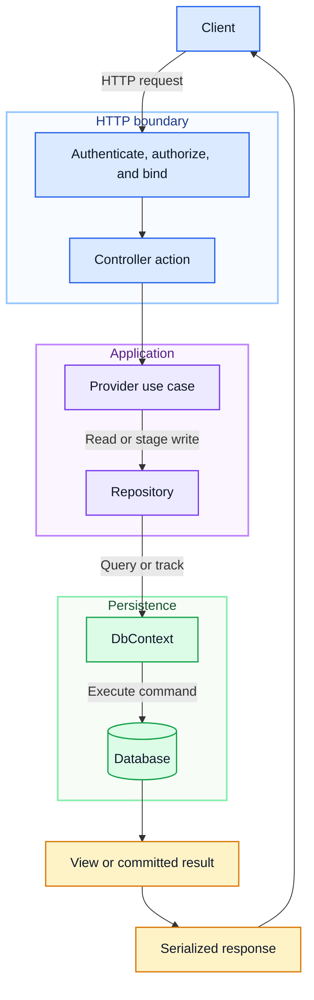

# Build a vertical slice

This tutorial follows one generic resource through the current `Guid`-based APIs. It focuses on the connections between layers. Replace the names and validation rule with language from your own domain.

## Follow the request


```mermaid
flowchart TB
  CLIENT[Client]

  subgraph HTTP[HTTP boundary]
    direction LR
    HOST[Authenticate, authorize, and bind]
    CONTROLLER[Controller action]
    HOST --> CONTROLLER
  end

  subgraph APPLICATION[Application]
    direction LR
    PROVIDER[Provider use case]
    REPOSITORY[Repository]
    PROVIDER -->|Read or stage write| REPOSITORY
  end

  subgraph PERSISTENCE[Persistence]
    direction LR
    CONTEXT[DbContext]
    DATABASE[(Database)]
    CONTEXT -->|Execute command| DATABASE
  end

  RESULT[View or committed result]
  RESPONSE[Serialized response]

  CLIENT -->|HTTP request| HOST
  CONTROLLER --> PROVIDER
  REPOSITORY -->|Query or track| CONTEXT
  DATABASE --> RESULT
  RESULT --> RESPONSE
  RESPONSE --> CLIENT

  style HTTP fill:#f8fbff,stroke:#93c5fd,stroke-width:2px,color:#1e3a8a
  style APPLICATION fill:#faf5ff,stroke:#c084fc,stroke-width:2px,color:#581c87
  style PERSISTENCE fill:#f7fcf7,stroke:#86efac,stroke-width:2px,color:#14532d

  classDef boundaryNode fill:#dbeafe,stroke:#2563eb,stroke-width:1.5px,color:#0f172a
  classDef applicationNode fill:#ede9fe,stroke:#7c3aed,stroke-width:1.5px,color:#0f172a
  classDef persistenceNode fill:#dcfce7,stroke:#16a34a,stroke-width:1.5px,color:#0f172a
  classDef resultNode fill:#fef3c7,stroke:#d97706,stroke-width:1.5px,color:#0f172a

  class CLIENT,HOST,CONTROLLER boundaryNode
  class PROVIDER,REPOSITORY applicationNode
  class CONTEXT,DATABASE persistenceNode
  class RESULT,RESPONSE resultNode
```

The result returns through the same application and HTTP boundaries even though the flowchart condenses those return mappings into the final result and response stages.

## Define the contract and models

The shared interface ties the editable entity and read view to one identifier type.

```csharp
public interface ICatalogItem : IEntity<Guid>
{
    string Name { get; set; }
}

public sealed class CatalogItemView : EntityBase<Guid>, ICatalogItem
{
    public string Name { get; set; } = string.Empty;
}
```

The editable entity maps the transport-facing view into domain state and validates the invariant.

```csharp
public sealed class CatalogItem
    : EntityBase<Guid, ICatalogItem, CatalogItem, CatalogItemView>,
      ICatalogItem
{
    public string Name { get; set; } = string.Empty;

    public override CatalogItem? MapFrom(
        IServiceProvider serviceProvider,
        ICatalogItem model)
    {
        Id = model.Id;
        Name = model.Name.Trim();
        return this;
    }

    public override CatalogItemView MapTo(IServiceProvider serviceProvider)
    {
        return new CatalogItemView { Id = Id, Name = Name };
    }

    public override void Validate()
    {
        var validator = new DomainValidator();
        validator.Assert(!string.IsNullOrWhiteSpace(Name), "Name is required.");
        validator.ThrowIfAny();
    }
}
```

In a generated solution, these classes are normally partial and the interface may be produced by the analyzer.

## Add repositories

The edit repository works with the table-backed entity. The read repository works with the view shape returned to callers.

```csharp
public interface ICatalogItemRepository
    : IEditRepository<CatalogItem, Guid>
{
}

public interface ICatalogItemViewRepository
    : IReadRepository<CatalogItemView, Guid>
{
}

public sealed class CatalogItemRepository
    : EditRepositoryBase<CatalogItem, ApplicationDbContext, Guid>,
      ICatalogItemRepository
{
    public CatalogItemRepository(IServiceProvider serviceProvider)
        : base(serviceProvider)
    {
    }
}

public sealed class CatalogItemViewRepository
    : ReadRepositoryBase<CatalogItemView, ApplicationDbContext, Guid>,
      ICatalogItemViewRepository
{
    public CatalogItemViewRepository(IServiceProvider serviceProvider)
        : base(serviceProvider)
    {
    }
}
```

The concrete names and interface names are important because registration discovers `I{ConcreteName}`.

## Add the provider

The generic edit provider now owns the standard save and delete workflow.

```csharp
public interface ICatalogItemProvider
    : IEditProvider<CatalogItemView, Guid>
{
}

public sealed class CatalogItemProvider
    : EditProviderBase<
        ICatalogItem,
        CatalogItem,
        CatalogItemView,
        ICatalogItemRepository,
        ICatalogItemViewRepository,
        Guid>,
      ICatalogItemProvider
{
    public CatalogItemProvider(IServiceProvider serviceProvider)
        : base(serviceProvider)
    {
    }
}
```

Add custom provider methods only when the use case is not already represented by the base contract. Keep entity invariants in the entity.

## Expose a protected API

The library's controller bases carry inherited `AllowAnonymous` metadata. Adding `Authorize` to a derived controller does not override that metadata, so use a direct ASP.NET Core controller for a protected API. Inject the provider and make the intended routes explicit.

```csharp
[ApiController]
[Route("catalog-items")]
[Authorize]
public sealed class CatalogItemsController : ControllerBase
{
    private readonly ICatalogItemProvider _provider;

    public CatalogItemsController(ICatalogItemProvider provider)
    {
        _provider = provider;
    }

    [HttpGet("{id:guid}")]
    [ExposeEndpoint]
    public Task<CatalogItemView> GetByIdAsync(Guid id) =>
        _provider.GetByIdAsync(id);

    [HttpPost("search")]
    [ExposeEndpoint]
    public Task<PaginatedResultDto<CatalogItemView>> SearchAsync(
        FilterTextPaginatedParameters parameters) =>
        _provider.SearchAsync(parameters);

    [HttpPost]
    [ExposeEndpoint]
    public Task<CatalogItemView> SaveAsync(CatalogItemView view) =>
        _provider.SaveAsync(view);

    [HttpDelete("{id:guid}")]
    [ExposeEndpoint]
    public Task DeleteAsync(Guid id) =>
        _provider.DeleteAsync(id);
}
```

`ExposeEndpoint` matters only when the host registers endpoint exposure control. It allows these actions through that filter, but it does not authenticate the caller or evaluate the `Authorize` policy.

## Register the layers

Register the connection provider and context before repositories are resolved. Use one scoped Unit of Work for the request.

```csharp
builder.Services.AddScoped<SqlServerDbContextConnectionProvider>();
builder.Services.RegisterContext<ApplicationDbContext>("ApplicationDatabase");
builder.Services.AddScoped<IUnitOfWork, UnitOfWork>();
builder.Services.RegisterLoggedUserService();

builder.Services
    .RegisterRepositories()
    .RegisterProviders()
    .RegisterServices([])
    .RegisterMappers()
    .RegisterEntities()
    .RegisterDtos();
```

If reflection-based JSON serialization is disabled, include the request and response types in a generated `JsonSerializerContext` and add its resolver to MVC options before running the endpoint.

## Verify the slice

Build before creating a migration or running the host. Confirm that discovery resolves both repository interfaces and the provider interface. Exercise an authorized save, get-by-id, search, and delete request. Verify invalid state reaches the exception handler as a domain error and that anonymous and underprivileged callers are rejected by the host policy.

The next useful guides are [Dependency registration](guides/dependency-registration.md), [Validation and errors](guides/validation-and-errors.md), and [Transactions](guides/transactions.md).
