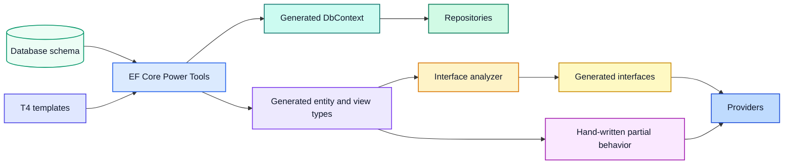

# Scaffold from a database

The Visual Studio template is designed for database-first development with EF Core Power Tools. Reverse engineering creates the context and persistence-shaped domain types. Partial classes then add behavior without modifying generated files.



## Prepare deterministic tooling and configuration

Prefer the official EF Core Power Tools CLI from a repository-local tool manifest and pin its exact approved version. Inspect that installed CLI's help and use its current `efcpt-config.json` schema; do not rename or translate keys from the Visual Studio extension's older `efpt.config.json` format. Review the context name, namespaces, entity/context output paths, explicit table/view/routine selection, nullable mappings, database naming, and T4 template root. Set object-list refresh deliberately so regeneration cannot silently broaden or shrink the owned model. Keep credentials and connection names out of the file.

Add the named connection string expected by the host through user secrets for local development:

```powershell
dotnet user-secrets set `
  "ConnectionStrings:ApplicationDatabase" `
  "Server=(localdb)\MSSQLLocalDB;Database=Sample;Integrated Security=true" `
  --project src/Sample.WebApi
```

The name passed to `RegisterContext<TContext>` must match the configuration key.

## Reverse engineer

Build the database project and publish its DACPAC to a disposable database before reverse engineering. A live database preserves view and computed-column metadata that DACPAC input may not expose completely. From the Data project/output root, run the pinned local command with the disposable connection supplied at execution time:

```powershell
dotnet tool restore
dotnet tool run efcpt -- $env:ConnectionStrings__ApplicationDatabase mssql `
  --input ./efcpt-config.json `
  --output .
```

The Visual Studio extension is optional convenience only. If a team uses it, maintain its extension-specific configuration independently and do not describe it as the deterministic build/regeneration path.

After generation, review the complete diff before adding behavior. Verify primary-key types, nullability, table and keyless `ToView` mappings, navigation properties, stored-procedure signatures, context naming, output paths, and the exact auto-generated ownership marker. Build immediately. Generation is not a substitute for reviewing the database contract.

Every consumer-facing major entity or transactional table should have a schema-bound `{Entity}View`. The view retains the entity's identifiers and scalar mapping surface, expands commonly used foreign keys with bounded descriptive joins, and remains one row per entity. A generated getter-only `I{Entity} : IEntity<TId>` contract should compile against both shapes. View-only joined fields remain on the view. Helper/reporting views and internal/status/history tables require a concrete consumer rather than an artificial entity interface.

## Add hand-written behavior

Create partial files beside generated entity and context files. Put invariants and mapping behavior in entity partials. Put extra model configuration in the context partial hook exposed by the template. Add repository contracts and implementations only after the generated types have stable names and identifiers.

Do not place application behavior inside T4 output. Do not add database credentials to generated configuration.

## Regenerate safely

Before every regeneration, commit or shelve unrelated work so the generated diff is visible. Treat only the configured entity and context output directories as replaceable. Prefer EFPT's exact auto-generated marker and explicit object list as the cleanup boundary; do not write a broad recursive cleanup or copy/move postprocessor. Regenerate, build immediately, then inspect interface-generator output and mapper dependencies. If a manual change disappeared, move the behavior to a partial file or change the owning template rather than reapplying it by hand.

Repositories retrieve editable entities and read views. They do not map entities into API DTOs. Providers own mapping, validation orchestration, transactions, commits, and external side effects.

Continue with [Build a vertical slice](../sample-application.md).
