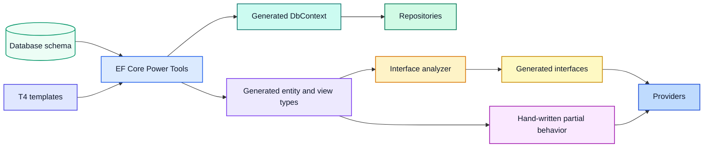

# Scaffold from a database

The Visual Studio template is designed for database-first development with EF Core Power Tools. Reverse engineering creates the context and persistence-shaped domain types. Partial classes then add behavior without modifying generated files.



## Prepare configuration

Copy the sample EF Core Power Tools configuration to the application-specific filename expected by the extension. Review the context name, namespaces, output paths, selected schemas, and T4 template paths. Keep credentials out of this file.

Add the named connection string expected by the host through user secrets for local development:

```powershell
dotnet user-secrets set `
  "ConnectionStrings:ApplicationDatabase" `
  "Server=(localdb)\MSSQLLocalDB;Database=Sample;Integrated Security=true" `
  --project src/Sample.WebApi
```

The name passed to `RegisterContext<TContext>` must match the configuration key.

## Reverse engineer

Open EF Core Power Tools from the Data project, select the connection, and choose only the tables, views, and routines owned by the module. Confirm that custom T4 templates are enabled before generating.

After generation, review the diff before adding behavior. Verify primary-key types, nullability, table and view mappings, navigation properties, stored-procedure signatures, and context naming. Generation is not a substitute for reviewing the database contract.

## Add hand-written behavior

Create partial files beside generated entity and context files. Put invariants and mapping behavior in entity partials. Put extra model configuration in the context partial hook exposed by the template. Add repository contracts and implementations only after the generated types have stable names and identifiers.

Do not place application behavior inside T4 output. Do not add database credentials to generated configuration.

## Regenerate safely

Before every regeneration, commit or shelve unrelated work so the generated diff is visible. Regenerate, build immediately, then inspect interface-generator output and mapper dependencies. If a manual change disappeared, move the behavior to a partial file or change the owning template rather than reapplying it by hand.

Continue with [Build a vertical slice](../sample-application.md).
