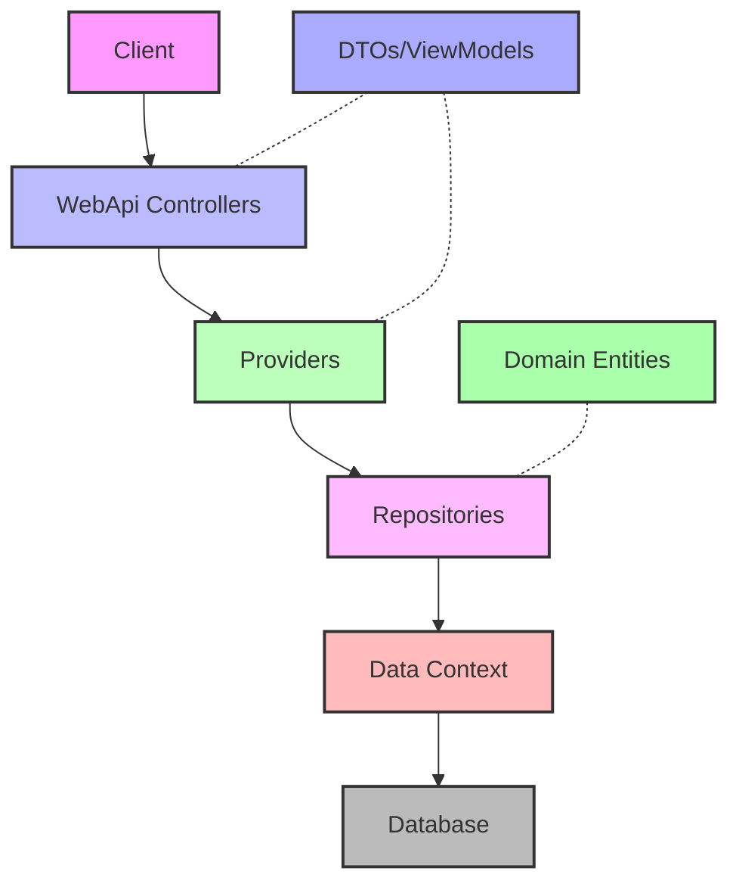
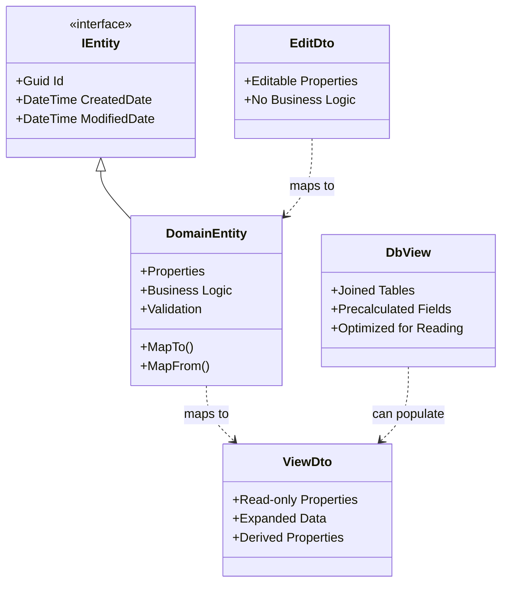
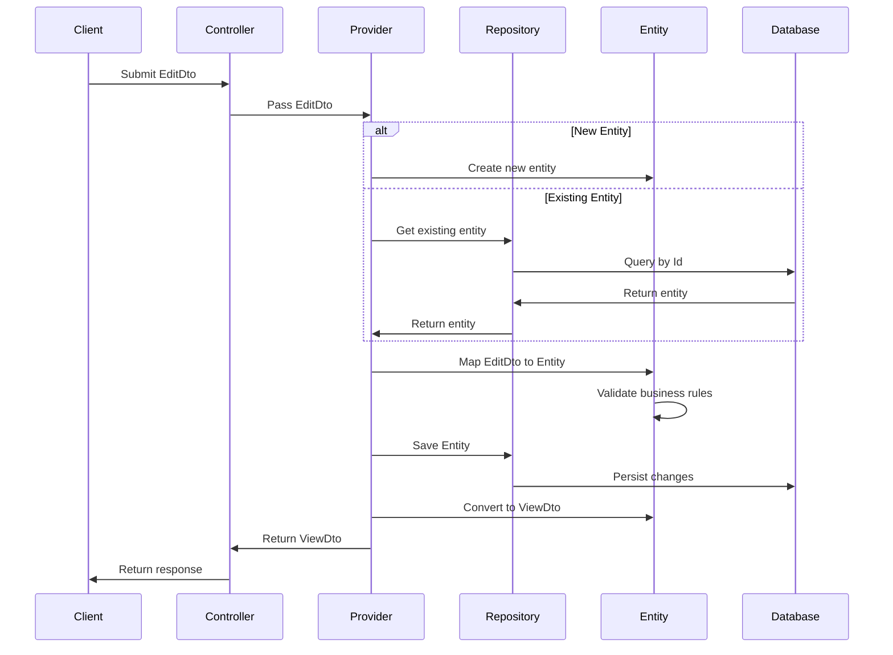
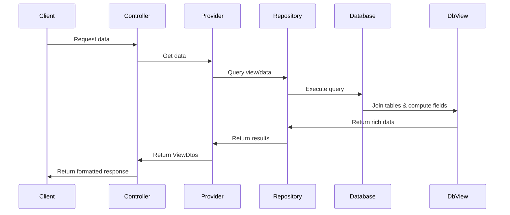

# 🔥 Building Apps with Paradigm.Enterprise: The Ultimate Guide

Hey there, developer! Let's dive into how Paradigm.Enterprise can transform your development workflow with a clean, layered architecture.

## 🚀 Getting Started in 60 Seconds

### Step 1: Create the Solution

```bash
# Create a new solution
dotnet new sln -n YourAwesomeApp

# Add projects for each layer
dotnet new classlib -n YourAwesomeApp.Interfaces
dotnet new classlib -n YourAwesomeApp.Domain
dotnet new classlib -n YourAwesomeApp.Data
dotnet new classlib -n YourAwesomeApp.Providers
dotnet new webapi -n YourAwesomeApp.WebApi

# Add projects to solution
dotnet sln add YourAwesomeApp.Interfaces
dotnet sln add YourAwesomeApp.Domain
dotnet sln add YourAwesomeApp.Data
dotnet sln add YourAwesomeApp.Providers
dotnet sln add YourAwesomeApp.WebApi
```

### Step 2: Install NuGet Packages

```bash
# Install Paradigm.Enterprise packages in each project
dotnet add YourAwesomeApp.Interfaces package Paradigm.Enterprise.Interfaces
dotnet add YourAwesomeApp.Domain package Paradigm.Enterprise.Domain
dotnet add YourAwesomeApp.Data package Paradigm.Enterprise.Data
dotnet add YourAwesomeApp.Providers package Paradigm.Enterprise.Providers
dotnet add YourAwesomeApp.WebApi package Paradigm.Enterprise.WebApi

# Add project references
dotnet add YourAwesomeApp.Domain reference YourAwesomeApp.Interfaces
dotnet add YourAwesomeApp.Data reference YourAwesomeApp.Domain
dotnet add YourAwesomeApp.Providers reference YourAwesomeApp.Data
dotnet add YourAwesomeApp.WebApi reference YourAwesomeApp.Providers
```

## 🏗️ Understanding the Architecture

The Paradigm.Enterprise framework is built around a clean, layered architecture that separates concerns and promotes maintainability. Here's a visual representation of the architecture:



### Understanding Data Flow and Object Types

In the Paradigm.Enterprise framework, data flows through several distinct types of objects, each with a specific purpose:

#### Object Types in the Architecture



#### Data Flow During Create/Update Operation

Here's how data flows through the system when creating or updating an entity:



#### Data Flow for Read Operations with Views

A key optimization is using database views for complex read operations:



## 🧩 The Role of Each Object Type

Let's clarify the purpose of each type of object in the system:

### Domain Entities

- Core business objects with data and behavior
- Implement business rules and validation logic
- Protected from external manipulation
- Enforce data integrity
- Only accessible within the system's internal layers
- Example: A `Product` with validation rules for price and inventory

### Entity Interfaces

- Define the contract for entities
- Allow interaction without exposing implementation details
- Enable loose coupling and dependency injection
- Make testing easier with mock implementations
- Example: `IProduct` defining common properties accessible across layers

### EditDtos

- Data Transfer Objects for accepting user inputs
- Flat structures, optimized for serialization/deserialization
- No business logic, just data containers
- Used for creation and update operations
- Example: `ProductEditDto` containing editable product properties

### ViewDtos

- Read-only representation of data for clients
- May include calculated or derived properties
- Tailored for specific UI requirements
- Can include data from multiple entities
- Example: `ProductViewDto` with basic product info plus creation date

### Database Views

- Optimized for read-heavy operations
- Combine data from multiple tables with joins
- Reduce roundtrips to the database
- Better performance for complex data retrieval
- Example: `ProductView` that includes product category name, supplier info, etc.

## 🏗️ Building Your App Layer by Layer

### 1️⃣ Define Your Interfaces

Start by defining your entity interfaces and DTOs:

```csharp
// YourAwesomeApp.Interfaces/User.cs
using Paradigm.Enterprise.Interfaces;

namespace YourAwesomeApp.Interfaces;

public interface IUser : IEntity
{
    string Username { get; set; }
    string Email { get; set; }
    bool IsActive { get; set; }
}

public class UserEditDto : IEditDto
{
    public Guid Id { get; set; }
    public string Username { get; set; } = string.Empty;
    public string Email { get; set; } = string.Empty;
    public bool IsActive { get; set; }
}

public class UserViewDto : IViewDto
{
    public Guid Id { get; set; }
    public string Username { get; set; } = string.Empty;
    public string Email { get; set; } = string.Empty;
    public bool IsActive { get; set; }
    public DateTime CreatedDate { get; set; }
}
```

### 2️⃣ Create Your Domain Entities

Next, implement your domain entities with validation rules:

```csharp
// YourAwesomeApp.Domain/User.cs
using System.ComponentModel.DataAnnotations;
using Paradigm.Enterprise.Domain.Entities;
using Paradigm.Enterprise.Domain.Exceptions;
using YourAwesomeApp.Interfaces;

namespace YourAwesomeApp.Domain;

public class User : EntityBase<IUser, UserEditDto, UserViewDto>, IUser
{
    [Required]
    [StringLength(50)]
    public string Username { get; set; } = string.Empty;

    [Required]
    [EmailAddress]
    public string Email { get; set; } = string.Empty;

    public bool IsActive { get; set; }

    public override void Validate()
    {
        var validationResults = new List<ValidationResult>();
        var validationContext = new ValidationContext(this);
        var isValid = Validator.TryValidateObject(this, validationContext, validationResults, true);

        if (!isValid)
        {
            var validator = new DomainValidator();
            foreach (var validationResult in validationResults)
            {
                validator.AddError(validationResult.ErrorMessage ?? "Validation failed");
            }
            throw new DomainException(validator.ToString());
        }
    }

    public override UserViewDto MapTo(IServiceProvider serviceProvider)
    {
        return new UserViewDto
        {
            Id = Id,
            Username = Username,
            Email = Email,
            IsActive = IsActive,
            CreatedDate = CreatedDate
        };
    }

    public override User? MapFrom(IServiceProvider serviceProvider, IUser model)
    {
        Id = model.Id;
        Username = model.Username;
        Email = model.Email;
        IsActive = model.IsActive;
        return this;
    }
}
```

### 3️⃣ Set Up Your Data Access

Create your DbContext and repositories:

```csharp
// YourAwesomeApp.Data/AppDbContext.cs
using Microsoft.EntityFrameworkCore;
using Paradigm.Enterprise.Data.Context;
using YourAwesomeApp.Domain;

namespace YourAwesomeApp.Data;

public class AppDbContext : DbContextBase
{
    public AppDbContext(DbContextOptions<AppDbContext> options) : base(options) { }

    public DbSet<User> Users { get; set; } = null!;

    protected override void OnModelCreating(ModelBuilder modelBuilder)
    {
        base.OnModelCreating(modelBuilder);

        modelBuilder.Entity<User>(entity =>
        {
            entity.HasKey(e => e.Id);
            entity.Property(e => e.Username).IsRequired().HasMaxLength(50);
            entity.Property(e => e.Email).IsRequired();
            entity.HasIndex(e => e.Email).IsUnique();
        });

        // Example of creating a database view
        modelBuilder.Entity<UserWithRoleView>().HasNoKey().ToView("vw_UsersWithRoles");
    }
}

// YourAwesomeApp.Data/Repositories/UserRepository.cs
using Paradigm.Enterprise.Data.Repositories;
using Paradigm.Enterprise.Domain.Repositories;
using YourAwesomeApp.Domain;

namespace YourAwesomeApp.Data.Repositories;

public class UserRepository : RepositoryBase<User>, IRepository<User>
{
    public UserRepository(AppDbContext dbContext) : base(dbContext) { }

    public async Task<User?> FindByEmailAsync(string email)
    {
        return await FirstOrDefaultAsync(u => u.Email == email);
    }
}
```

### 4️⃣ Implement Your Providers

Add business logic with providers:

```csharp
// YourAwesomeApp.Providers/UserProvider.cs
using Paradigm.Enterprise.Domain.Repositories;
using Paradigm.Enterprise.Domain.Uow;
using Paradigm.Enterprise.Providers;
using YourAwesomeApp.Domain;
using YourAwesomeApp.Interfaces;

namespace YourAwesomeApp.Providers;

public class UserProvider : ProviderBase<User, IUser, UserEditDto, UserViewDto>
{
    private readonly IRepository<User> _repository;

    public UserProvider(
        IRepository<User> repository,
        IUnitOfWork unitOfWork,
        IServiceProvider serviceProvider)
        : base(repository, unitOfWork, serviceProvider)
    {
        _repository = repository;
    }

    public async Task<UserViewDto?> FindByEmailAsync(string email)
    {
        var repository = (YourAwesomeApp.Data.Repositories.UserRepository)_repository;
        var user = await repository.FindByEmailAsync(email);
        return user?.MapTo(ServiceProvider);
    }
}
```

### 5️⃣ Build Your API

Finally, create your API controllers:

```csharp
// YourAwesomeApp.WebApi/Controllers/UsersController.cs
using Microsoft.AspNetCore.Mvc;
using YourAwesomeApp.Interfaces;
using YourAwesomeApp.Providers;

namespace YourAwesomeApp.WebApi.Controllers;

[ApiController]
[Route("api/[controller]")]
public class UsersController : ControllerBase
{
    private readonly UserProvider _userProvider;

    public UsersController(UserProvider userProvider)
    {
        _userProvider = userProvider;
    }

    [HttpGet]
    public async Task<ActionResult<IEnumerable<UserViewDto>>> GetAll()
    {
        var users = await _userProvider.GetAllAsync();
        return Ok(users);
    }

    [HttpGet("{id}")]
    public async Task<ActionResult<UserViewDto>> GetById(Guid id)
    {
        var user = await _userProvider.GetByIdAsync(id);
        if (user == null) return NotFound();
        return Ok(user);
    }

    [HttpPost]
    public async Task<ActionResult<UserViewDto>> Create(UserEditDto userDto)
    {
        var user = await _userProvider.CreateAsync(userDto);
        return CreatedAtAction(nameof(GetById), new { id = user.Id }, user);
    }

    [HttpPut("{id}")]
    public async Task<ActionResult> Update(Guid id, UserEditDto userDto)
    {
        if (id != userDto.Id) return BadRequest();

        var result = await _userProvider.UpdateAsync(userDto);
        if (result == null) return NotFound();

        return NoContent();
    }

    [HttpDelete("{id}")]
    public async Task<ActionResult> Delete(Guid id)
    {
        var result = await _userProvider.DeleteAsync(id);
        if (!result) return NotFound();

        return NoContent();
    }
}
```

### 6️⃣ Wire Everything Up

Configure your services:

```csharp
// YourAwesomeApp.WebApi/Program.cs
using Microsoft.EntityFrameworkCore;
using Paradigm.Enterprise.Data.UoW;
using Paradigm.Enterprise.Domain.Repositories;
using Paradigm.Enterprise.Domain.Uow;
using YourAwesomeApp.Data;
using YourAwesomeApp.Data.Repositories;
using YourAwesomeApp.Domain;
using YourAwesomeApp.Providers;

var builder = WebApplication.CreateBuilder(args);

builder.Services.AddControllers();
builder.Services.AddEndpointsApiExplorer();
builder.Services.AddSwaggerGen();

// Database connection
builder.Services.AddDbContext<AppDbContext>(options =>
    options.UseSqlServer(builder.Configuration.GetConnectionString("DefaultConnection")));

// Register core services
builder.Services.AddScoped<IUnitOfWork, UnitOfWork<AppDbContext>>();
builder.Services.AddScoped<IRepository<User>, UserRepository>();
builder.Services.AddScoped<UserProvider>();

var app = builder.Build();

if (app.Environment.IsDevelopment())
{
    app.UseSwagger();
    app.UseSwaggerUI();
}

app.UseHttpsRedirection();
app.UseAuthorization();
app.MapControllers();

app.Run();
```

## 🎯 Pro Tips

1. **Domain-Driven Design** - Entity behaviors keep your domain logic focused
2. **Separation of Concerns** - Each layer has a clear and distinct responsibility
3. **Database Optimization** - Use views for complex read operations to reduce roundtrips
4. **Validation** - Keep validation in your domain entities to ensure data integrity
5. **Async Everything** - Use async/await throughout for better performance

## 🤔 Common Questions

### "Why separate DTOs, Entities, and Views?"

- **DTOs** are optimized for client interaction
- **Entities** enforce business rules and data integrity
- **Database Views** optimize data retrieval performance

### "Can I use this with existing databases?"

Absolutely! Just configure your DbContext to map to your existing tables and views.

### "What about authentication?"

Add the Paradigm.Enterprise.Auth package for built-in JWT auth support!

### "Is it production-ready?"

Yes, this framework is designed for real-world, enterprise applications.

## 🚀 Next Steps

Now you're equipped to build clean, maintainable applications with clear separation of concerns and optimized data flows.

Happy coding! 🎉
